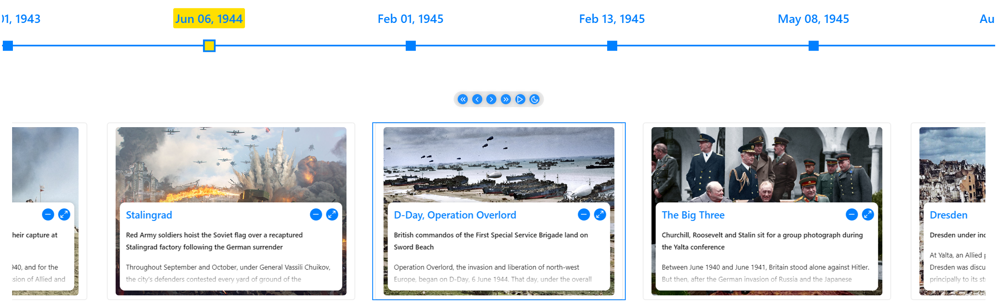
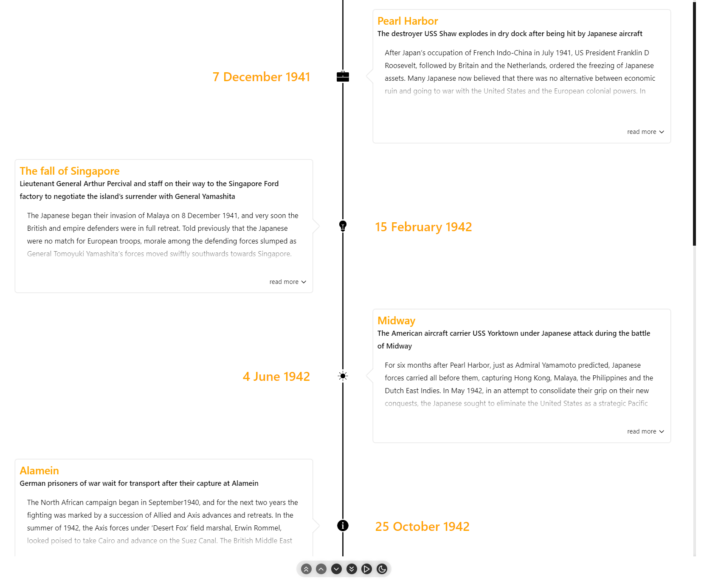
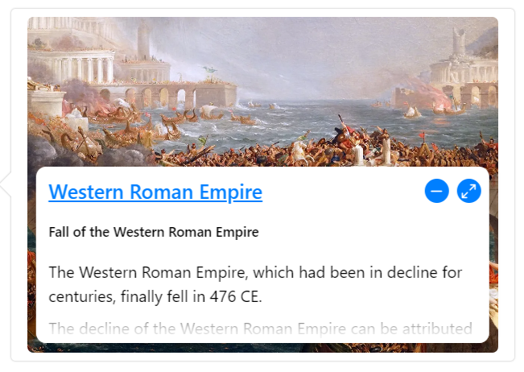

<div align="center">
  

  <br/>
  <br/>

[](https://dev.azure.com/prabhummurthy/react-chrono/_build/latest?definitionId=7&branchName=master)
[](https://deepscan.io/dashboard#view=project&tid=10074&pid=13644&bid=234929)
[](https://www.codacy.com/manual/prabhuignoto/react-chrono?utm_source=github.com&utm_medium=referral&utm_content=prabhuignoto/react-chrono&utm_campaign=Badge_Grade)
[](https://dashboard.cypress.io/projects/8zb5a5/runs)
[](https://snyk.io/test/github/prabhuignoto/react-chrono)
[](https://depfu.com/github/prabhuignoto/react-chrono?project_id=15325)

[](https://prettier.io/)
[](https://opensource.org/licenses/MIT)
[](https://www.npmjs.com/package/react-chrono)

<a href="https://5f985eb478dcb00022cfd60e-hqwgomhkqw.chromatic.com/?path=/story/example-vertical--vertical-basic" target="_blank"></a>
[](https://coveralls.io/github/prabhuignoto/react-chrono?branch=master)

  <div>
    
  </div>

</div>

<!-- **Try it on CodeSandbox!**

[](https://codesandbox.io/s/react-chrono-bg56e?fontsize=14&hidenavigation=1&theme=dark) -->

<h2>Features</h2>

- 🚥 Render timelines in three different modes ([Horizontal](#getting-started), [Vertical](#vertical-mode), [Vertical-Alternating](#vertical-alternating)).
- 📺&nbsp; Auto play the timeline with the [slideshow](#slideshow-mode) mode.
- 🖼️&nbsp; [Display Images & Videos](#media) in the timeline with ease.
- ⌨&nbsp; [Keyboard accessible](#keyboard-navigation).
- 🔧&nbsp; [Render](#rendering-custom-content) custom content easily.
- 🌿&nbsp; [Nested timelines](#nested-timelines).
- ⚡&nbsp; Data driven API.
- 🎨&nbsp; [Customize](#theme) colors with ease.
- 🎭&nbsp; Use [custom icons](#custom-icons-for-the-timeline) in the timeline.
- 💪&nbsp; Built with [Typescript](https://www.typescriptlang.org/).
- 🎨&nbsp; Styled with [emotion](https://emotion.sh).

<h2>Table of Contents</h2>

- [⚡ Installation](#-installation)
- [Getting Started](#getting-started)
  - [🚥Vertical Mode](#vertical-mode)
  - [🚥Vertical Alternating](#vertical-alternating)
- [Props](#props)
  - [Mode](#mode)
  - [Timeline item Model](#timeline-item-model)
  - [⌨Keyboard Navigation](#keyboard-navigation)
  - [Scrollable](#scrollable)
  - [📺Media](#media)
  - [Text overlay mode](#text-overlay-mode)
  - [🛠Rendering custom content](#rendering-custom-content)
  - [🎭Custom icons for the Timeline](#custom-icons-for-the-timeline)
  - [🌿Nested Timelines](#nested-timelines)
  - [Slideshow](#slideshow)
  - [Outline](#outline)
  - [Item Width](#item-width)
  - [🎥Media Settings](#media-settings)
  - [Breakpoint](#breakpoint)
  - [🎨Theme](#theme)
  - [Customize Font sizes](#customize-font-sizes)
  - [Customize alt text for buttons](#customize-alt-text-for-buttons)
- [Using custom class names](#using-custom-class-names)
- [📦CodeSandbox Examples](#codesandbox-examples)
- [Kitchen Sink](#kitchen-sink)
- [📚Storybook](#storybook)
- [🔨Build Setup](#build-setup)
- [🧪Tests](#tests)
- [🤝Contributing](#contributing)
- [🧱Built with](#built-with)
- [Meta](#meta)
- [Contributors ✨](#contributors-)

## ⚡ Installation

```jsx
// install with yarn
yarn add react-chrono

// or with npm
npm install react-chrono
```

## Getting Started

Please make sure you wrap the component in a container that has a `width` and `height`.

When no `mode` is specified, the component defaults to `HORIZONTAL` mode. Please check [props](#props) for all the available options.

```jsx
  import React from "react"
  import { Chrono } from "react-chrono";

  const Home = () => {
    const items = [{
      title: "May 1940",
      cardTitle: "Dunkirk",
      url: "http://www.history.com",
      cardSubtitle:"Men of the British Expeditionary Force (BEF) wade out to..",
      cardDetailedText: "Men of the British Expeditionary Force (BEF) wade out to..",
      media: {
        type: "IMAGE",
        source: {
          url: "http://someurl/image.jpg"
        }
      }
    }, ...];

    return (
      <div style={{ width: "500px", height: "400px" }}>
        <Chrono items={items} />
      </div>
    )
  }
```



### 🚥Vertical Mode

To render the timeline vertically use the `VERTICAL` mode

```jsx
<div style={{ width: '500px', height: '950px' }}>
  <Chrono items={items} mode="VERTICAL" />
</div>
```


### 🚥Vertical Alternating

In `VERTICAL_ALTERNATING` mode the timeline is rendered vertically with cards alternating between left and right side.

```jsx
<div style={{ width: '500px', height: '950px' }}>
  <Chrono items={items} mode="VERTICAL_ALTERNATING" />
</div>
```



## Props

Below are the available configuration options for the component:

| Name                     | Default              | Description                                                                                                                              |
| :----------------------- | :------------------- | :--------------------------------------------------------------------------------------------------------------------------------------- |
| activeItemIndex          | 0                    | Selects the active timeline item when loading.                                                                                           |
| allowDynamicUpdate       | false                | Enables or disables dynamic updates of timeline items.                                                                                   |
| borderLessCards          | false                | Removes borders and shadows from the timeline cards.                                                                                     |
| buttonTexts              |                      | Customizes the alternative text for all buttons.                                                                                         |
| cardHeight               | 200                  | Defines the minimum height of timeline cards.                                                                                            |
| cardLess                 | false                | Disables timeline cards in both horizontal and vertical layouts.                                                                         |
| cardPositionHorizontal   |                      | Positions the card in horizontal mode. Options: `TOP` or `BOTTOM`.                                                                       |
| cardWidth                |                      | Sets the maximum width of timeline cards.                                                                                                |
| classNames               |                      | Applies custom class names to different card elements.                                                                                   |
| contentDetailsHeight     | 150                  | Controls the height of the details section if using cardDetailedText. Refer to [TimelineItem model](#timeline-item-model) for more info. |
| disableAutoScrollOnClick | false                | Prevents auto-scrolling when a timeline card is clicked.                                                                                 |
| disableClickOnCircle     | false                | Disables the click action on circular points.                                                                                            |
| disableInteraction       | false                | Disables all the interactions with the Timeline.                                                                                         |
| disableNavOnKey          | false                | Turns off keyboard navigation.                                                                                                           |
| disableTimelinePoint     | false                | Disables the timeline point in both `HORIZONTAL` and `VERTICAL` mode.                                                                    |
| enableBreakPoint         | true                 | Automatically switches to vertical mode when the vertical breakpoint is reached.                                                         |
| enableDarkToggle         | false                | Adds a toggle switch for dark mode.                                                                                                      |
| enableOutline            | false                | Enables an outline menu in vertical and vertical alternating modes.                                                                      |
| flipLayout               | false                | Reverses the layout (Right to Left).                                                                                                     |
| focusActiveItemOnLoad    | false                | Automatically scrolls to and focuses on the `activeItemIndex` when loading.                                                              |
| fontSizes                |                      | Allows customization of font sizes.                                                                                                      |
| hideControls             | false                | Hides navigation controls.                                                                                                               |
| highlightCardsOnHover    | false                | Highlights the card on hover                                                                                                             |
| items                    | []                   | A collection of Timeline Item Models.                                                                                                    |
| itemWidth                | 300                  | Sets the width of the timeline section in horizontal mode.                                                                               |
| lineWidth                | 3px                  | Adjusts the width of the timeline track line.                                                                                            |
| mediaHeight              | 200                  | Sets the minimum height for media elements like images or videos in the card.                                                            |
| mediaSettings            |                      | Configures settings specific to media layout. Refer to [mediaSettings](#media-settings) for more info.                                   |
| mode                     | VERTICAL_ALTERNATING | Sets the component mode. Options: `HORIZONTAL`, `VERTICAL`, `VERTICAL_ALTERNATING`.                                                      |
| nestedCardHeight         | 150                  | Defines the height of nested timeline cards.                                                                                             |
| noUniqueId               | false                | Prevents generating a unique id for the table wrapper.                                                                                   |
| onItemSelected           |                      | Invokes a callback on item selection, passing relevant data.                                                                             |
| onScrollEnd              |                      | Detects the end of the timeline via `onScrollEnd`.                                                                                       |
| onThemeChange            |                      | Invokes a callback when the theme changes, triggered via `enableDarkToggle`.                                                             |
| parseDetailsAsHTML       | false                | Parses the `cardDetailedText` as HTML.                                                                                                   |
| scrollable               | true                 | Makes the timeline scrollable in `VERTICAL` and `VERTICAL_ALTERNATING` modes.                                                            |
| showAllCardsHorizontal   | false                | Displays all cards in horizontal mode. By default, only the active card is shown.                                                        |
| slideItemDuration        | 5000                 | Sets the duration (in milliseconds) that a timeline card is active during a slideshow.                                                   |
| slideShow                | false                | Enables slideshow control.                                                                                                               |
| textOverlay              | false                | Displays text as an overlay on media elements. Refer to [Text Overlay](#text-overlay-mode) for more info.                                |
| theme                    |                      | Customizes colors. Refer to [Theme](#theme) for more info.                                                                               |
| timelinePointDimension   |                      | Defines the dimensions of circular points on the timeline.                                                                               |
| timelinePointShape       | circle               | Configures the shape of timeline points. Options: circle, square, diamond.                                                               |
| titleDateFormat          | 'MMM DD, YYYY'       | Formats the date for each timeline item. Supports all [dayjs](https://day.js.org/) formats.                                              |
| uniqueId                 |                      | Used with `noUniqueId` to set a custom unique id for the wrapper.                                                                        |
| useReadMore              | true                 | Enables or disables the "read more" button. Available if text content on the card is taller than the card itself.                        |
| verticalBreakPoint       | 768px                | Sets the pixel count below which the timeline will switch to `VERTICAL` mode.                                                            |

### Mode

`react-chrono` supports three modes `HORIZONTAL`, `VERTICAL` and `VERTICAL_ALTERNATING`. No additional setting is required.

```jsx
<Chrono items={items} mode="HORIZONTAL" />
```

```jsx
<Chrono items={items} mode="VERTICAL" />
```

```jsx
<Chrono items={items} mode="VERTICAL_ALTERNATING" />
```

### Timeline item Model

| name               | description                                                                                   | type               |
| ------------------ | --------------------------------------------------------------------------------------------- | ------------------ |
| `cardDetailedText` | detailed text displayed in the timeline card                                                  | String or String[] |
| `cardSubtitle`     | text displayed in the timeline card                                                           | String             |
| `cardTitle`        | title that is displayed on the timeline card                                                  | String             |
| `date`             | date to be used in the title. when used, this will override the title property                | Date               |
| [`media`](#media)  | media object to set image or video                                                            | Object             |
| `timelineContent`  | render custom content instead of text.This prop has higher precedence over `cardDetailedText` | ReactNode          |
| `title`            | title of the timeline item                                                                    | String             |
| `url`              | url to be used in the title                                                                   | String             |

```jsx
{
  title: "May 1940",
  cardTitle: "Dunkirk",
  cardSubtitle:
    "Men of the British Expeditionary Force (BEF) wade out to a destroyer during the evacuation from Dunkirk.",
  cardDetailedText: ["paragraph1", "paragraph2"],
  timelineContent: <div>Custom content</div>,
}
```

if you have a large text to display(via `cardDetailedText`) and want to split the text into paragraphs, you can pass an `array` of strings.

each array entry will be created as a paragraph inside the timeline card.

### ⌨Keyboard Navigation

The timeline can be navigated via keyboard.

- For `HORIZONTAL` mode use your <kbd>LEFT</kbd> <kbd>RIGHT</kbd> arrow keys for navigation.
- For `VERTICAL` or `VERTICAL_ALTERNATING` mode, the timeline can be navigated via the <kbd>UP</kbd> <kbd>DOWN</kbd> arrow keys.
- To easily jump to the first item or the last item in the timeline, use <kbd>HOME</kbd> or <kbd>END</kbd> keys.

To disable keyboard navigation set `disableNavOnKey` to true.

```jsx
<Chrono items={items} disableNavOnKey />
```

### Scrollable

With the scrollable prop, you can enable scrolling on both `VERTICAL` and `VERTICAL_ALTERNATING` modes.

```jsx
<Chrono items={items} scrollable />
```

The scrollbar is not shown by default. To enable the scrollbar, pass an object with prop `scrollbar` to `scrollable` prop.

```jsx
<Chrono items={items} scrollable={{ scrollbar: true }} />
```

### 📺Media

> Both images and videos can be embedded in the timeline.

Just add the `media` attribute to the [Timeline Item model](#timeline-item-model) and the component will take care of the rest.

<h5>
  To embed a image
</h5>

```jsx
{
  title: "May 1940",
  cardTitle: "Dunkirk",
  media: {
    name: "dunkirk beach",
    source: {
      url: "http://someurl/image.jpg"
    },
    type: "IMAGE"
  }
}
```

<h5>
  To embed a video
</h5>

> Videos start playing automatically when active and will be automatically paused when not active.

Like images, videos are also automatically hidden when not in the visible viewport of the container.

```jsx
{
  title: "7 December 1941",
  cardTitle: "Pearl Harbor",
  media: {
    source: {
      url: "/pearl-harbor.mp4",
      type: "mp4"
    },
    type: "VIDEO",
    name: "Pearl Harbor"
  }
}
```

To embed YouTube videos, use the right embed url.

```jsx
{
  title: "7 December 1941",
  cardTitle: "Pearl Harbor",
  media: {
    source: {
      url: "https://www.youtube.com/embed/f6cz9gtMTeI",
      type: "mp4"
    },
    type: "VIDEO",
    name: "Pearl Harbor"
  }
}
```


### Text overlay mode

The `textOverlay` prop allows you to overlay text on top of a media element in a card.To enable the text overlay feature, simply add the text property to the items array in your Chrono timeline data. Here's an example:

```jsx
import { Chrono } from 'react-chrono';

const items = [
  {
    title: 'First item',
    media: {
      type: 'IMAGE',
      source: {
        url: 'https://example.com/image.jpg',
      },
    },
    text: 'This is the caption for the first item.',
  },
];

function MyTimeline() {
  return <Chrono items={items} textOverlay />;
}
```

The user can click on the `expand` button to expand the text and see more details. Here's what it looks like:



> With the textOverlay prop, you can give your timeline a modern and sleek look, and provide additional context or information about each item.

### 🛠Rendering custom content

The Timeline cards of the component can also support embedded custom content. To insert custom content, pass the blocked elements between the Chrono tags. For instance, the below code snippet will generate two timeline items, where each div element will be automatically converted into a timeline item and inserted into the timeline card. The items collection mentioned in the code is completely optional, and custom rendering is supported on all three modes.

```jsx
<Chrono mode="VERTICAL">
  <div>
    <p>Lorem Ipsum. Lorem Ipsum. Lorem Ipsum</p>
  </div>
  <div>
    
  </div>
</Chrono>
```

> Note that the items collection will also work well with any custom content that is passed. In the following code snippet, the title and cardTitle are set for the custom contents.

```jsx
const items = [
  { title: 'Timeline title 1', cardTitle: 'Card Title 1' },
  { title: 'Timeline title 2', cardTitle: 'Card Title 2' },
];

<Chrono mode="VERTICAL" items={items}>
  <div>
    <p>Lorem Ipsum. Lorem Ipsum. Lorem Ipsum</p>
  </div>
  <div>
    
  </div>
</Chrono>;
```

### 🎭Custom icons for the Timeline

To utilize personalized icons on the timeline, enclose a collection of images between the `chrono` tags, wrapped in a container.

The icons are arranged sequentially; meaning, the first image that you pass in will be used as the icon for the first timeline item, and so on.

It is important to note that the image collection must be passed in inside a container with the designated `chrono-icons` className. This is a required convention, as the component relies on this className to select the appropriate images.

```jsx
<Chrono items={items} mode="VERTICAL_ALTERNATING">
  <div className="chrono-icons">
    
    
  </div>
</Chrono>
```

> custom icons also works if you are [rendering custom content](#rendering-custom-content) inside the cards.

```jsx
<Chrono mode="VERTICAL" items={items}>
  <div>
    <p>Lorem Ipsum. Lorem Ipsum. Lorem Ipsum</p>
  </div>
  <div>
    
  </div>
  <div className="chrono-icons">
    
    
  </div>
</Chrono>
```

### 🌿Nested Timelines

Nested timelines in React-Chrono allow you to display timelines within timeline cards. This feature is data-driven, which means that if a timeline item has an `items` array, the component will automatically attempt to render the nested timeline inside the timeline card.

To use nested timelines, simply provide an array of items within the `items` property of a timeline item. The component will then take care of rendering the nested timeline for you.

You can also adjust the height of the nested timeline card using the `nestedCardHeight` prop. This allows you to control the size of the card to fit your specific use case.

```jsx
const items = [
  {
    title: 'Timeline title 1',
    cardTitle: 'Card Title 1',
    items: [
      { cardTitle: 'nested card title 1' },
      { cardTitle: 'nested card title 2' },
    ],
  },
  { title: 'Timeline title 2', cardTitle: 'Card Title 2' },
];

<Chrono mode="VERTICAL" items={items}></Chrono>;
```

### Slideshow

Enabling the slideshow feature can be done by setting the `slideShow` prop to true. Additionally, an optional `slideItemDuration` prop can be set to determine the time delay between cards.

Enabling this prop will cause the play button to appear in the timeline control panel. Use the `slideShowType` prop to set the type of slideshow animation.

| Mode                 | Default Slideshow Type |
| :------------------- | :--------------------- |
| VERTICAL             | `reveal`               |
| VERTICAL_ALTERNATING | `slide_from_sides`     |
| HORIZONTAL           | `slide_in`             |

```jsx
<Chrono
  items={items}
  slideShow
  slideItemDuration={4500}
  slideShowType="reveal"
/>
```

> The slideshow can be cancelled by clicking on the stop button in the control panel or by pressing the `ESC` key.

### Outline

With `enableOutline` prop you can enable outline on the timelines and quickly jump to a specific timeline item.
The outlines are only supported on `VERTICAL` and `VERTICAL_ALTERNATING` modes.

```jsx
<Chrono items={items} enableOutline />
```


### Item Width

The `itemWidth` prop can be used to set the width of each individual timeline sections. This setting is applicable only for the `HORIZONTAL` mode.

### 🎥Media Settings

Use media settings to align the media or change how a image is displayed in the card.

| Name  | Description                                    | Type   | Default |
| :---- | :--------------------------------------------- | :----- | :------ |
| align | aligns the media. can be left, right or center | string | center  |
| fit   | fits the image. can be cover or contain        | string | cover   |

```jsx
<Chrono items={items} mediaSettings={{ align: 'right', fit: 'contain' }} />
```

### Breakpoint

Use the breakpoint feature to automatically switch the timeline to `VERTICAL` mode when there is not enough space for `VERTICAL_ALTERNATING` mode, such as on mobile devices. Set the auto switch to happen by enabling the `enableBreakPoint` prop and specifying the pixel limit with the `verticalBreakPoint` prop.

```jsx
<Chrono items={items} enableBreakPoint verticalBreakPoint={400} />
```

### 🎨Theme

Customize colors with the `theme` prop.

```jsx
<Chrono
  items={items}
  theme={{
    primary: 'red',
    secondary: 'blue',
    cardBgColor: 'yellow',
    titleColor: 'black',
    titleColorActive: 'red',
  }}
/>
```

### Customize Font sizes

Use the `fontSizes` prop to customize the font sizes of the timeline card.

```jsx
<Chrono
  items={data}
  mode="HORIZONTAL"
  fontSizes={{
    cardSubtitle: '0.85rem',
    cardText: '0.8rem',
    cardTitle: '1rem',
    title: '1rem',
  }}
></Chrono>
```

### Customize alt text for buttons

With the `buttonTexts` prop, you can change the button's alt text.

```jsx
<Chrono
  items={data}
  mode="HORIZONTAL"
  buttonTexts={{
    first: 'Jump to First',
    last: 'Jump to Last',
    next: 'Next',
    previous: 'Previous',
  }}
></Chrono>
```

Defaults

| Property   | Value            |
| :--------- | :--------------- |
| `first`    | 'Go to First'    |
| `last`     | 'Go to Last'     |
| `next`     | 'Next'           |
| `play`     | 'Play Slideshow' |
| `previous` | 'Previous'       |

## Using custom class names

You can use the classNames prop to employ your own class names. The subsequent example illustrates how you can use custom class names on different elements.

```jsx
<Chrono
  className="my-timeline"
  items={items}
  classNames={{
    card: 'my-card',
    cardMedia: 'my-card-media',
    cardSubTitle: 'my-card-subtitle',
    cardText: 'my-card-text',
    cardTitle: 'my-card-title',
    controls: 'my-controls',
    title: 'my-title',
  }}
/>
```

## 📦CodeSandbox Examples

- [Horizontal Basic](https://codesandbox.io/s/keen-shannon-gtjwn?file=/src/App.js)
- [Horizontal - Show all cards](https://codesandbox.io/s/show-all-cards-5vuf2x?file=/src/App.js)
- [Vertical basic](https://codesandbox.io/s/react-chrono-vertical-basic-0rm1o?file=/src/App.js)
- [Vertical Alternating](https://codesandbox.io/s/react-chrono-tree-text-1fcs3?file=/src/App.js)
- [Vertical All Images](https://codesandbox.io/s/react-chrono-tree-vertical-images-b5zri?file=/src/App.js)
- [Vertical Custom content](https://codesandbox.io/s/react-chrono-vertical-custom-qepnm?file=/src/App.js)
- [Vertical Custom content with items collections](https://codesandbox.io/s/react-chrono-vertical-custom-2-uctcp?file=/src/App.js)
- [Custom Icons](https://codesandbox.io/s/react-chrono-custom-icons-x9s2k?file=/src/App.js)

## Kitchen Sink

- [Kitchen Sink](https://react-chrono-kitchen-sink.prabhumurthy.com/)

## 📚Storybook

Deep dive into wide variety of examples hosted as a Storybook.

- [Horizontal Collection](https://5f985eb478dcb00022cfd60e-oihbvdsnij.chromatic.com/?path=/story/example-horizontal--horizontal-timeline)
- [Vertical Collection](https://5f985eb478dcb00022cfd60e-oihbvdsnij.chromatic.com/?path=/story/example-vertical--vertical-basic)

## 🔨Build Setup

```bash
# install dependencies
pnpm install

# start dev
pnpm dev

# run css linting
pnpm lint:css

# eslint
pnpm eslint

# prettier
pnpm lint

# package lib
pnpm rollup
```

## 🧪Tests

```jsx
  # run unit tests
  pnpm test

  # run cypress tests
  pnpm cypress:test
```

## 🤝Contributing

1. [Fork it](https://github.com/prabhuignoto/react-chrono/fork)
2. Create your feature branch (`git checkout -b new-feature`)
3. Commit your changes (`git commit -am 'Add feature'`)
4. Push to the branch (`git push origin new-feature`)
5. Create a new Pull Request

## 🧱Built with

- [Typescript](https://www.typescriptlang.org/).
- Styled with [emotion](https://emotion.sh/).

## Meta

Huge thanks to [BrowserStack](https://www.browserstack.com/) for the Open Source License!

Distributed under the MIT license. See `LICENSE` for more information.

Prabhu Murthy – [@prabhumurthy2](https://twitter.com/prabhumurthy2) – <prabhu.m.murthy@gmail.com>
[https://github.com/prabhuignoto](https://github.com/prabhuignoto)

<a href="https://www.buymeacoffee.com/prabhuignoto" target="_blank"></a>

<a>
  
</a>

<!-- Markdown link & img dfn's -->

## Contributors ✨

Thanks goes to these wonderful people ([emoji key](https://allcontributors.org/docs/en/emoji-key)):

<!-- ALL-CONTRIBUTORS-LIST:START - Do not remove or modify this section -->
<!-- prettier-ignore-start -->
<!-- markdownlint-disable -->
<table>
  <tbody>
    <tr>
      <td align="center" valign="top" width="14.28%"><a href="http://aloisdg.github.io/"><br /><sub><b>Alois</b></sub></a><br /><a href="https://github.com/prabhuignoto/react-chrono/commits?author=aloisdg" title="Documentation">📖</a></td>
      <td align="center" valign="top" width="14.28%"><a href="https://kojikoji.ga"><br /><sub><b>Koji</b></sub></a><br /><a href="https://github.com/prabhuignoto/react-chrono/commits?author=koji" title="Documentation">📖</a></td>
      <td align="center" valign="top" width="14.28%"><a href="http://alexgirard.com"><br /><sub><b>Alexandre Girard</b></sub></a><br /><a href="https://github.com/prabhuignoto/react-chrono/commits?author=alx" title="Code">💻</a></td>
      <td align="center" valign="top" width="14.28%"><a href="https://github.com/Ryuyxx"><br /><sub><b>Ryuya</b></sub></a><br /><a href="https://github.com/prabhuignoto/react-chrono/commits?author=Ryuyxx" title="Documentation">📖</a></td>
      <td align="center" valign="top" width="14.28%"><a href="https://github.com/taqi457"><br /><sub><b>Taqi Abbas</b></sub></a><br /><a href="https://github.com/prabhuignoto/react-chrono/commits?author=taqi457" title="Code">💻</a></td>
      <td align="center" valign="top" width="14.28%"><a href="https://github.com/megasoft78"><br /><sub><b>megasoft78</b></sub></a><br /><a href="https://github.com/prabhuignoto/react-chrono/commits?author=megasoft78" title="Code">💻</a></td>
      <td align="center" valign="top" width="14.28%"><a href="https://dev.bigdreamer.cc"><br /><sub><b>Eric（书生）</b></sub></a><br /><a href="https://github.com/prabhuignoto/react-chrono/commits?author=bigbigDreamer" title="Code">💻</a></td>
    </tr>
    <tr>
      <td align="center" valign="top" width="14.28%"><a href="https://github.com/DrakeXorn"><br /><sub><b>Christophe Bernard</b></sub></a><br /><a href="https://github.com/prabhuignoto/react-chrono/commits?author=DrakeXorn" title="Code">💻</a></td>
    </tr>
  </tbody>
</table>

<!-- markdownlint-restore -->
<!-- prettier-ignore-end -->

<!-- ALL-CONTRIBUTORS-LIST:END -->

This project follows the [all-contributors](https://github.com/all-contributors/all-contributors) specification. Contributions of any kind welcome!
