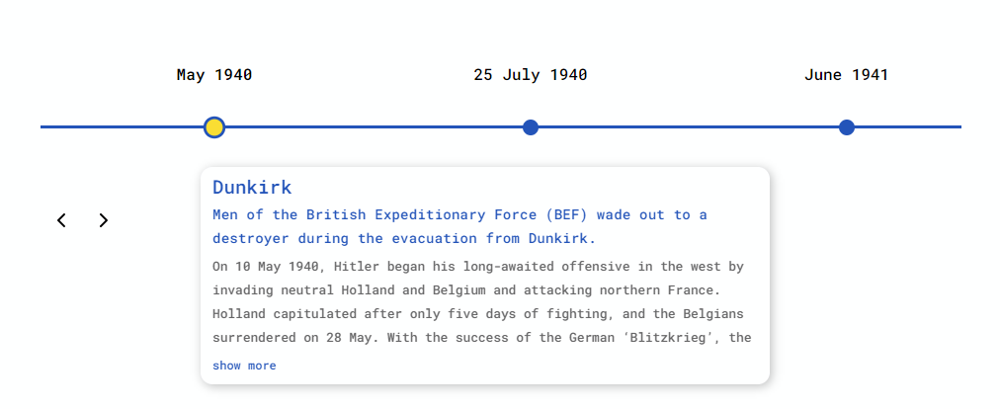
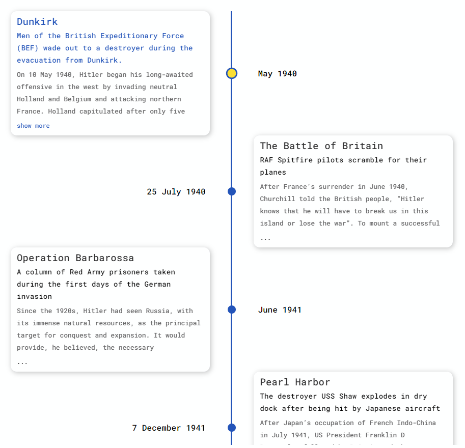

[](https://deepscan.io/dashboard#view=project&tid=10074&pid=13508&bid=229834)
[](https://depfu.com/github/prabhuignoto/react-crono?project_id=15325)


> A timeline component for React

## Features

- **Timeline modes** - The component supports multiple modes to layout the timeline either `Vertically` or `Horizontally`.
- **Tree Mode** - In `Tree` mode the individual timeline content boxes are alternated between left and right.
- **Timeline QuickScroll** - The `QuickScroll` allows to jump through the Timeline items swiftly. QuickScroll is by default enabled on all the Modes.
- **Slideshow** - The `Slideshow` starts the component in Slideshow mode. The component automatically plays the series for you.
- **QuickJump** - Quickly jump to the start or end of the timeline by using the  <kbd>HOME</kbd> or <kbd>END</kbd> key.
- **Keyboard Support** - The timelines can be navigated with the <kbd>UP</kbd> , <kbd>DOWN</kbd> keys in `vertical` or `tree` mode. In `horizontal` mode <kbd>LEFT</kbd> , <kbd>RIGHT</kbd> keys can be used for navigation.

## Installation

```sh
yarn run install && yarn run start
```

## Getting Started

`react-crono` has some great defaults to get you started quickly.

```sh
  const items = [{
    title: "May 1940",
    contentTitle: "Dunkirk",
    contentText:"Men of the British Expeditionary Force (BEF) wade out to a destroyer during the evacuation from Dunkirk.",
    contentDetailedText: "On 10 May 1940, Hitler began his long-awaited offensive in the west by invading neutral Holland and Belgium and attacking northern France...",
  }, ...];

  <Timeline items={items} />
```



## Tree

`react-crono` also supports a Tree mode.

```sh
  <Timeline
    items={items}
    mode="TREE"
  />
```



## Props

| name               | description                                                                           | default      |
|--------------------|---------------------------------------------------------------------------------------|--------------|
| mode               | sets the layout for the timeline component. can be `HORIZONTAL`, `VERTICAL` or `TREE` | `HORIZONTAL` |
| disableNavOnScroll | disables timeline navigation through mouse scroll                                     | false        |
| disableNavOnKey    | disables timeline navigation through keyboard                                         | false        |
| slideShow          | starts the timeline in slideshow                                                      |              |
| slideItemDuration  | delay between timeline points during a slideshow                                      | 2500         |
| titlePosition      | sets the position of the title in `HORIZONTAL` mode                                   | `TOP`        |
| itemWidth          | width of the timeline section in `HORIZONTAL` mode                                    | 320          |

## Built with

- [ReactJS](react) - The Component is written in React and [Typescript](typescript).

## Meta

Prabhu Murthy – [@prabhumurthy2](https://twitter.com/prabhumurthy2) – prabhu.m.murthy@gmail.com

Distributed under the MIT license. See `LICENSE` for more information.

[https://github.com/prabhuingoto/](https://github.com/prabhuingoto/)

<!-- Markdown link & img dfn's -->

[react]: https://reactjs.org
[typescript]: https://typescriptlang.org
