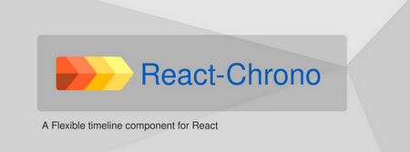
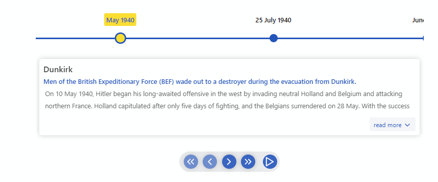
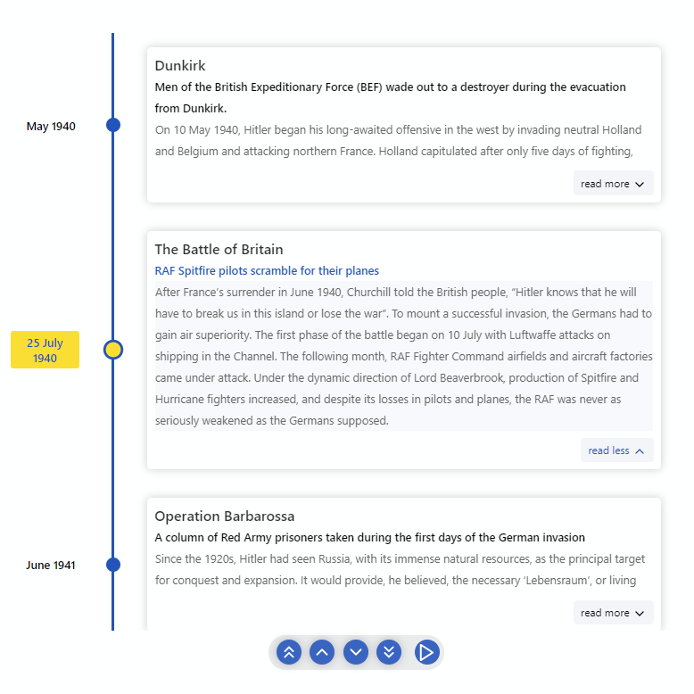
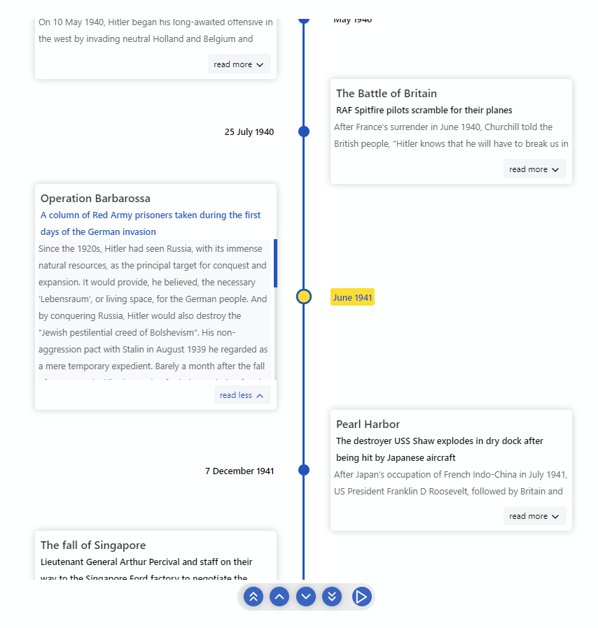
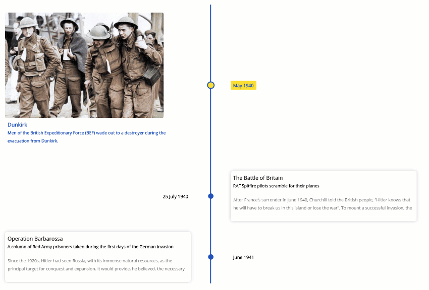
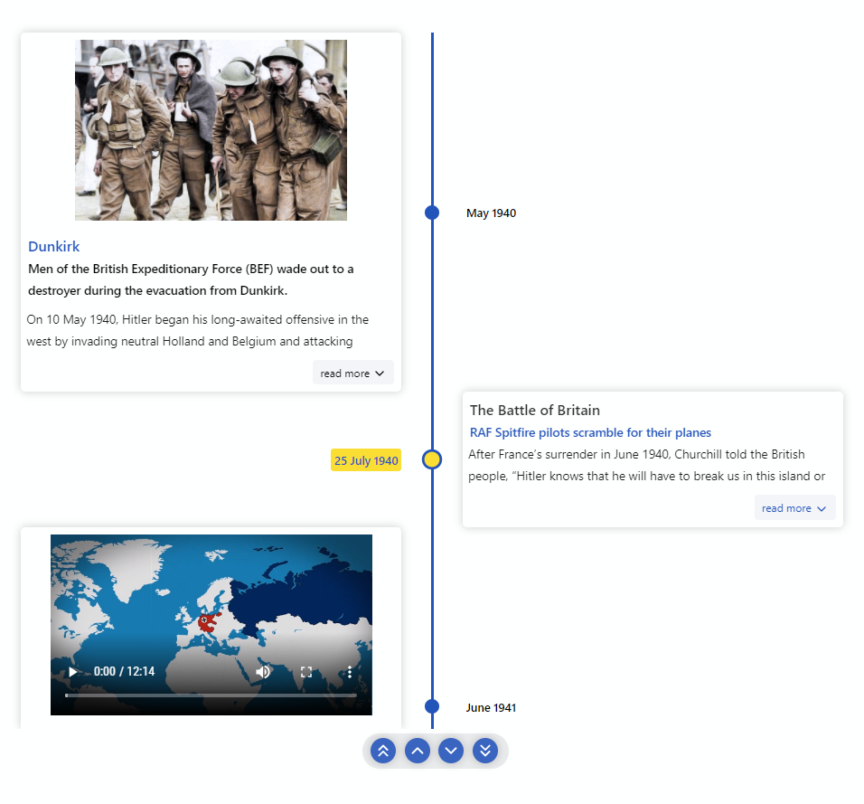
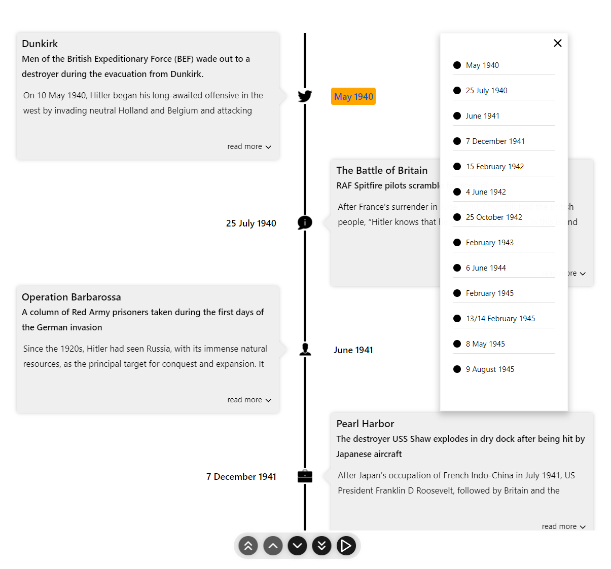

<div align="center">
  
  
  <br/>
  <br/>

[](https://dev.azure.com/prabhummurthy/react-chrono/_build/latest?definitionId=7&branchName=master)
[](https://deepscan.io/dashboard#view=project&tid=10074&pid=13644&bid=234929)
[](https://www.codacy.com/manual/prabhuignoto/react-chrono?utm_source=github.com&utm_medium=referral&utm_content=prabhuignoto/react-chrono&utm_campaign=Badge_Grade)
[](https://dashboard.cypress.io/projects/8zb5a5/runs)

[](https://depfu.com/github/prabhuignoto/react-chrono?project_id=15325)

<a href="https://5f985eb478dcb00022cfd60e-ywtootfinv.chromatic.com/?path=/story/example-vertical--vertical-basic" target="_blank"></a>

  <div>
    
  </div>

</div>

<!-- **Try it on CodeSandbox!**

[](https://codesandbox.io/s/react-chrono-bg56e?fontsize=14&hidenavigation=1&theme=dark) -->

<h2>Features</h2>

- 🚥 Render timelines in three different modes ([Horizontal](#getting-started), [Vertical](#vertical-mode), [Vertical-Alternating](#vertical-alternating)).
- 📺&nbsp; Auto play the timeline with the [slideshow](#slideshow-mode) mode.
- 🖼️&nbsp; [Display Images & Videos](#media) in the timeline with ease.
- ⌨&nbsp; [Keyboard accessible](#keyboard-navigation).
- 🔧&nbsp; [Render](#rendering-custom-content) custom content easily.
- ⚡&nbsp; Data driven API.
- 🎨&nbsp; [Customize](#theme) colors with ease.
- 🎭&nbsp; Use [custom icons](#custom-icons-for-the-timeline) in the timeline.
- 💪&nbsp; Built with [Typescript](https://www.typescriptlang.org/).
- 🎨&nbsp; Styled with [emotion](https://emotion.sh).

<h2>Table of Contents</h2>

- [⚡ Installation](#-installation)
- [Getting Started](#getting-started)
  - [🚥Vertical Mode](#vertical-mode)
  - [🚥Vertical Alternating](#vertical-alternating)
  - [📺Slideshow](#slideshow)
- [Props](#props)
  - [Mode](#mode)
  - [Timeline item Model](#timeline-item-model)
  - [⌨Keyboard Navigation](#keyboard-navigation)
  - [Scrollable](#scrollable)
  - [📺Media](#media)
  - [🛠Rendering custom content](#rendering-custom-content)
  - [🎭Custom icons for the Timeline](#custom-icons-for-the-timeline)
  - [Slideshow mode](#slideshow-mode)
  - [Outline](#outline)
  - [Item Width](#item-width)
  - [🎨Theme](#theme)
  - [Customize Font sizes](#customize-font-sizes)
- [📦CodeSandbox Examples](#codesandbox-examples)
- [📚Storybook](#storybook)
- [🔨Build Setup](#build-setup)
- [🧪Tests](#tests)
- [🤝Contributing](#contributing)
- [🧱Built with](#built-with)
- [Meta](#meta)
- [Contributors ✨](#contributors-)

## ⚡ Installation

```jsx
yarn add react-chrono
```

## Getting Started

Please make sure you wrap the component in a container that has a `width` and `height`.

When no `mode` is specified, the component defaults to `HORIZONTAL` mode. Please check [props](#props) for all the available options.

```jsx
  import React from "react"
  import { Chrono } from "react-chrono";

  const Home = () => {
    const items = [{
      title: "May 1940",
      cardTitle: "Dunkirk",
      url: "http://www.history.com",
      cardSubtitle:"Men of the British Expeditionary Force (BEF) wade out to..",
      cardDetailedText: "Men of the British Expeditionary Force (BEF) wade out to..",
      media: {
        type: "IMAGE",
        source: {
          url: "http://someurl/image.jpg"
        }
      }
    }, ...];

    return (
      <div style={{ width: "500px", height: "400px" }}>
        <Chrono items={items} />
      </div>
    )
  }
```



### 🚥Vertical Mode

To render the timeline vertically use the `VERTICAL` mode

```jsx
<div style={{ width: '500px', height: '950px' }}>
  <Chrono items={items} mode="VERTICAL" />
</div>
```



### 🚥Vertical Alternating

In `VERTICAL_ALTERNATING` mode the timeline is rendered vertically with cards alternating between left and right side.

```jsx
<div style={{ width: '500px', height: '950px' }}>
  <Chrono items={items} mode="VERTICAL_ALTERNATING" />
</div>
```



### 📺Slideshow

Play the timeline automatically with the `slideShow` mode. This prop enables the play button on the ui controls.

```jsx
<div style={{ width: '500px', height: '950px' }}>
  <Chrono items={items} slideShow mode="VERTICAL_ALTERNATING" />
</div>
```

<!--  -->

## Props

| name                     | description                                                                                                                                          | default      |
| ------------------------ | ---------------------------------------------------------------------------------------------------------------------------------------------------- | ------------ |
| activeItemIndex          | Selects the active timeline item on load.                                                                                                            | 0            |
| allowDynamicUpdate       | Allows timeline items to be updated dynamically.                                                                                                     | false        |
| borderLessCards          | Removes the border & shadow from the timeline cards.                                                                                                 | false        |
| cardHeight               | Sets the minimum height of the timeline card.                                                                                                        | 200          |
| cardLess                 | Disables timeline cards on both horizontal and vertical modes.                                                                                       | false        |
| cardPositionHorizontal   | Positions the card in `HORIZONTAL` mode. can be either `TOP` or `BOTTOM`.                                                                            |              |
| cardWidth                | Sets the maximum width of the timeline card.                                                                                                         |              |
| disableAutoScrollOnClick | Disables the timeline from auto-scrolling when a timeline card is clicked.                                                                           | false        |
| disableClickOnCircle     | Disables click action on the circular points.                                                                                                        | false        |
| disableNavOnKey          | Disables keyboard navigation.                                                                                                                        | false        |
| enableOutline            | Enables the outline menu on `VERTICAL` and `VERTICAL_ALTERNATING` mode.                                                                              | false        |
| flipLayout               | Flips the layout (RTL).                                                                                                                              | false        |
| hideControls             | Hides the navigation controls.                                                                                                                       | false        |
| itemWidth                | Width of the timeline section in `HORIZONTAL` mode.                                                                                                  | 300          |
| items                    | Collection of [Timeline Item Model](#timeline-item-model).                                                                                           | []           |
| lineWidth                | Prop to customize the width of the timeline track line.                                                                                              | 3px          |
| mode                     | Sets the mode of the component. can be `HORIZONTAL`, `VERTICAL` or `VERTICAL_ALTERNATING`.                                                           | `HORIZONTAL` |
| onItemSelected           | Callback invoked on a item selection. passes all of the data pertinent to the item.                                                                  |              |
| onScrollEnd              | Use the `onScrollEnd` to detect the end of the timeline.                                                                                             |              |
| scrollable               | Makes the timeline [scrollable](#scrollable) (applicable for `VERTICAL` & `VERTICAL_ALTERNATING`).                                                   | true         |
| showAllCardsHorizontal   | In horizontal mode, only the active card is displayed. With this prop, you can display all the cards.                                                | false        |
| slideItemDuration        | Duration (in ms), the timeline card is active during a `slideshow`.                                                                                  | 5000         |
| slideShow                | Enables the slideshow control.                                                                                                                       | false        |
| theme                    | Prop to customize the colors.                                                                                                                        |              |
| timelineCircleDimension  | Dimensions of the circular points on the timeline                                                                                                    | false        |
| useReadMore              | Enables or disables the "read more" button. The "read more" button is only available if the text content on the card is taller than the card itself. | true         |
| fontSizes                | property to customize the font sizes                                                                                                                 |              |

### Mode

`react-chrono` supports three modes `HORIZONTAL`, `VERTICAL` and `VERTICAL_ALTERNATING`. No additional setting is required.

```jsx
<Chrono items={items} mode="HORIZONTAL" />
```

```jsx
<Chrono items={items} mode="VERTICAL" />
```

```jsx
<Chrono items={items} mode="VERTICAL_ALTERNATING" />
```

### Timeline item Model

| name             | description                                  | type               |
| ---------------- | -------------------------------------------- | ------------------ |
| title            | title of the timeline item                   | String             |
| cardTitle        | title that is displayed on the timeline card | String             |
| cardSubtitle     | text displayed in the timeline card          | String             |
| cardDetailedText | detailed text displayed in the timeline card | String or String[] |
| media            | media object to set image or video.          | Object             |
| url              | url to be used in the title.                 | String             |

```jsx
{
  title: "May 1940",
  cardTitle: "Dunkirk",
  cardSubtitle:
    "Men of the British Expeditionary Force (BEF) wade out to a destroyer during the evacuation from Dunkirk.",
  cardDetailedText: ["paragraph1", "paragraph2"],
}
```

if you have a large text to display(via `cardDetailedText`) and want to split the text into paragraphs, you can pass an `array` of strings.

each array entry will be created as a paragraph inside the timeline card.

### ⌨Keyboard Navigation

The timeline can be navigated via keyboard.

- For `HORIZONTAL` mode use your <kbd>LEFT</kbd> <kbd>RIGHT</kbd> arrow keys for navigation.
- For `VERTICAL` or `VERTICAL_ALTERNATING` mode, the timeline can be navigated via the <kbd>UP</kbd> <kbd>DOWN</kbd> arrow keys.
- To easily jump to the first item or the last item in the timeline, use <kbd>HOME</kbd> or <kbd>END</kbd> keys.

To disable keyboard navigation set `disableNavOnKey` to true.

```jsx
<Chrono items={items} disableNavOnKey />
```

### Scrollable

With the scrollable prop, you can enable scrolling on both `VERTICAL` and `VERTICAL_ALTERNATING` modes.

```jsx
<Chrono items={items} scrollable />
```

The scrollbar is not shown by default. To enable the scrollbar, pass an object with prop `scrollbar` to `scrollable` prop.

```jsx
<Chrono items={items} scrollable={{ scrollbar: true }} />
```

### 📺Media

> Both images and videos can be embedded in the timeline.

Just add the `media` attribute to the [Timeline Item model](#timeline-item-model) and the component will take care of the rest.

<h5>
  To embed a image
</h5>

```jsx
{
  title: "May 1940",
  cardTitle: "Dunkirk",
  media: {
    name: "dunkirk beach",
    source: {
      url: "http://someurl/image.jpg"
    },
    type: "IMAGE"
  }
}
```

<h5>
  To embed a video
</h5>

> Videos start playing automatically when active and will be automatically paused when not active.

Like images, videos are also automatically hidden when not in the visible viewport of the container.

```jsx
{
  title: "7 December 1941",
  cardTitle: "Pearl Harbor",
  media: {
    source: {
      url: "/pearl-harbor.mp4",
      type: "mp4"
    },
    type: "VIDEO",
    name: "Pearl Harbor"
  }
}
```

To embed YouTube videos, use the right embed url.

```jsx
{
  title: "7 December 1941",
  cardTitle: "Pearl Harbor",
  media: {
    source: {
      url: "https://www.youtube.com/embed/f6cz9gtMTeI",
      type: "mp4"
    },
    type: "VIDEO",
    name: "Pearl Harbor"
  }
}
```



### 🛠Rendering custom content

The component also supports embedding custom content in the `Timeline` cards.

To insert custom content, just pass the blocked elements between the `Chrono` tags.

For e.g the below snippet will create 2 timeline items. Each `div` element is automatically converted into a timeline item and inserted into the timeline card.
The [items](#timeline-item-model) collection is completely optional and custom rendering is supported on all 3 [modes](#mode).

```jsx
<Chrono mode="VERTICAL">
  <div>
    <p>Lorem Ipsum. Lorem Ipsum. Lorem Ipsum</p>
  </div>
  <div>
    
  </div>
</Chrono>
```

> The items collection will also work nicely with any custom content that is passed.

The following snippet sets the the `title` and `cardTitle` for the custom contents.

```jsx
const items = [
  { title: 'Timeline title 1', cardTitle: 'Card Title 1' },
  { title: 'Timeline title 2', cardTitle: 'Card Title 2' },
];

<Chrono mode="VERTICAL" items={items}>
  <div>
    <p>Lorem Ipsum. Lorem Ipsum. Lorem Ipsum</p>
  </div>
  <div>
    
  </div>
</Chrono>;
```

### 🎭Custom icons for the Timeline

To use custom icons in the timeline, pass in the collection of images between the `chrono` tags wrapped in a container.

The icons are sequentially set (i.e) the first image you pass will be used as the icon for the first timeline item and so on.

Please make sure to pass in the image collection inside a container with a special className `chrono-icons`. This convention is mandatory as the component uses this `class name` to pick the images.

```jsx
<Chrono items={items} mode="VERTICAL_ALTERNATING">
  <div className="chrono-icons">
    
    
  </div>
</Chrono>
```

> custom icons also works if you are [rendering custom content](#rendering-custom-content) inside the cards.

```jsx
<Chrono mode="VERTICAL" items={items}>
  <div>
    <p>Lorem Ipsum. Lorem Ipsum. Lorem Ipsum</p>
  </div>
  <div>
    
  </div>
  <div className="chrono-icons">
    
    
  </div>
</Chrono>
```

### Slideshow mode

Slideshow can be enabled by setting the `slideShow` prop to true. You can also set an optional `slideItemDuration` that sets the time delay between cards.

setting this prop enables the play button in the timeline control panel.

```jsx
<Chrono items={items} slideShow slideItemDuration={4500} />
```

### Outline

With `enableOutline` prop you can enable outline on the timelines and quickly jump to a specific timeline item.
The outlines are only supported on `VERTICAL` and `VERTICAL_ALTERNATING` modes.

```jsx
<Chrono items={items} enableOutline />
```



### Item Width

The `itemWidth` prop can be used to set the width of each individual timeline sections. This setting is applicable only for the `HORIZONTAL` mode.

### 🎨Theme

Customize colors with the `theme` prop.

```jsx
<Chrono
  items={items}
  theme={{
    primary: 'red',
    secondary: 'blue',
    cardBgColor: 'yellow',
    cardForeColor: 'violet',
    titleColor: 'black',
    titleColorActive: 'red',
  }}
/>
```

### Customize Font sizes

Use the `fontSizes` prop to customize the font sizes of the timeline card.

```jsx
<Chrono
  items={data}
  mode="HORIZONTAL"
  fontSizes={{
    cardSubtitle: '0.85rem',
    cardText: '0.8rem',
    cardTitle: '1rem',
    title: '1rem',
  }}
></Chrono>
```

## 📦CodeSandbox Examples

- [Horizontal Basic](https://codesandbox.io/s/keen-shannon-gtjwn?file=/src/App.js)
- [Horizontal - Show all cards](https://codesandbox.io/s/show-all-cards-5vuf2x?file=/src/App.js)
- [Vertical basic](https://codesandbox.io/s/react-chrono-vertical-basic-0rm1o?file=/src/App.js)
- [Vertical Alternating](https://codesandbox.io/s/react-chrono-tree-text-1fcs3?file=/src/App.js)
- [Vertical All Images](https://codesandbox.io/s/react-chrono-tree-vertical-images-b5zri?file=/src/App.js)
- [Vertical Custom content](https://codesandbox.io/s/react-chrono-vertical-custom-qepnm?file=/src/App.js)
- [Vertical Custom content with items collections](https://codesandbox.io/s/react-chrono-vertical-custom-2-uctcp?file=/src/App.js)
- [Custom Icons](https://codesandbox.io/s/react-chrono-custom-icons-x9s2k?file=/src/App.js)

## 📚Storybook

Deep dive into wide variety of examples hosted as a Storybook.

- [Horizontal Collection](https://5f985eb478dcb00022cfd60e-ywtootfinv.chromatic.com/?path=/story/example-horizontal--horizontal-timeline)
- [Vertical Collection](https://5f985eb478dcb00022cfd60e-ywtootfinv.chromatic.com/?path=/story/example-vertical--vertical-basic)

## 🔨Build Setup

```bash
# install dependencies
yarn install

# start dev
yarn dev

# run css linting
yarn lint:css

# eslint
yarn eslint

# prettier
yarn lint

# package lib
yarn rollup
```

## 🧪Tests

```jsx
  # run unit tests
  yarn test

  # run cypress tests
  yarn cypress:test
```

## 🤝Contributing

1. [Fork it](https://github.com/prabhuignoto/react-chrono/fork)
2. Create your feature branch (`git checkout -b new-feature`)
3. Commit your changes (`git commit -am 'Add feature'`)
4. Push to the branch (`git push origin new-feature`)
5. Create a new Pull Request

## 🧱Built with

- [Typescript](https://www.typescriptlang.org/).
- Styled with [emotion](https://emotion.sh/).

## Meta

Huge thanks to [BrowserStack](https://www.browserstack.com/) for the Open Source License!

Distributed under the MIT license. See `LICENSE` for more information.

Prabhu Murthy – [@prabhumurthy2](https://twitter.com/prabhumurthy2) – prabhu.m.murthy@gmail.com
[https://github.com/prabhuignoto](https://github.com/prabhuignoto)

<a href="https://www.buymeacoffee.com/prabhuignoto" target="_blank"></a>

<!-- Markdown link & img dfn's -->

[react]: https://reactjs.org
[typescript]: https://typescriptlang.org
[emotion]: https://emotion.sh/

## Contributors ✨

Thanks goes to these wonderful people ([emoji key](https://allcontributors.org/docs/en/emoji-key)):

<!-- ALL-CONTRIBUTORS-LIST:START - Do not remove or modify this section -->
<!-- prettier-ignore-start -->
<!-- markdownlint-disable -->
<table>
  <tr>
    <td align="center"><a href="http://aloisdg.github.io/"><br /><sub><b>Alois</b></sub></a><br /><a href="https://github.com/prabhuignoto/react-chrono/commits?author=aloisdg" title="Documentation">📖</a></td>
    <td align="center"><a href="https://kojikoji.ga"><br /><sub><b>Koji</b></sub></a><br /><a href="https://github.com/prabhuignoto/react-chrono/commits?author=koji" title="Documentation">📖</a></td>
    <td align="center"><a href="http://alexgirard.com"><br /><sub><b>Alexandre Girard</b></sub></a><br /><a href="https://github.com/prabhuignoto/react-chrono/commits?author=alx" title="Code">💻</a></td>
    <td align="center"><a href="https://github.com/Ryuyxx"><br /><sub><b>Ryuya</b></sub></a><br /><a href="https://github.com/prabhuignoto/react-chrono/commits?author=Ryuyxx" title="Documentation">📖</a></td>
    <td align="center"><a href="https://github.com/taqi457"><br /><sub><b>Taqi Abbas</b></sub></a><br /><a href="https://github.com/prabhuignoto/react-chrono/commits?author=taqi457" title="Code">💻</a></td>
    <td align="center"><a href="https://github.com/megasoft78"><br /><sub><b>megasoft78</b></sub></a><br /><a href="https://github.com/prabhuignoto/react-chrono/commits?author=megasoft78" title="Code">💻</a></td>
  </tr>
</table>

<!-- markdownlint-restore -->
<!-- prettier-ignore-end -->

<!-- ALL-CONTRIBUTORS-LIST:END -->

This project follows the [all-contributors](https://github.com/all-contributors/all-contributors) specification. Contributions of any kind welcome!
