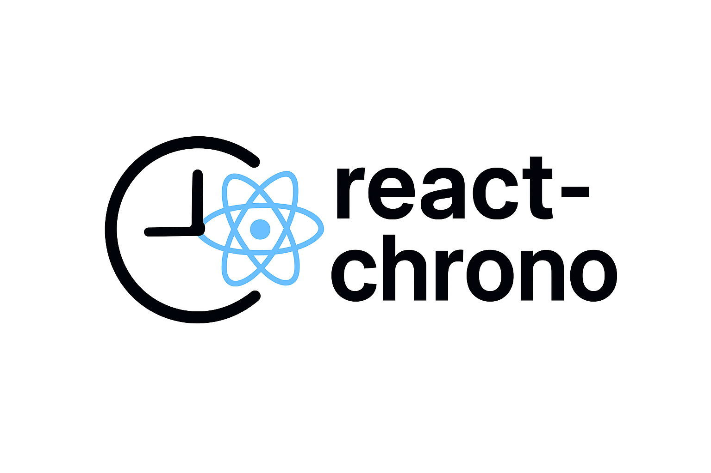
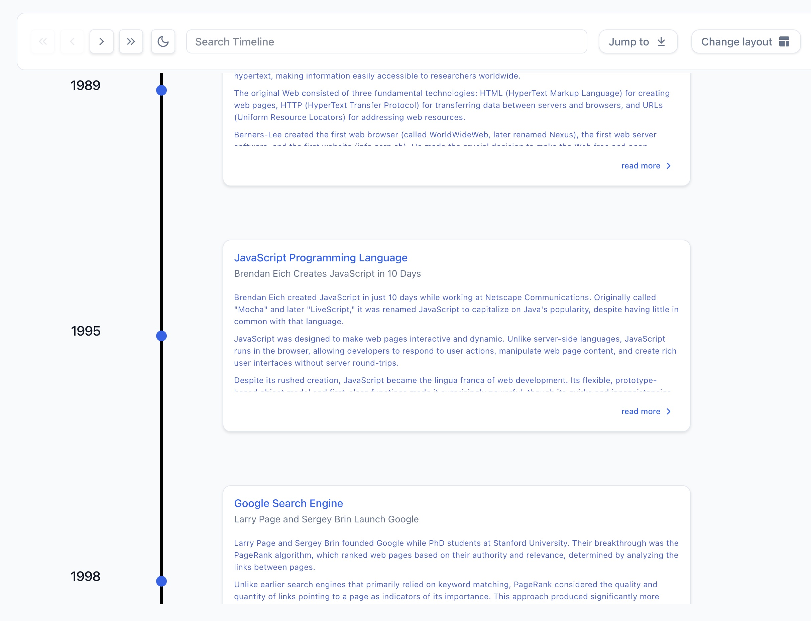
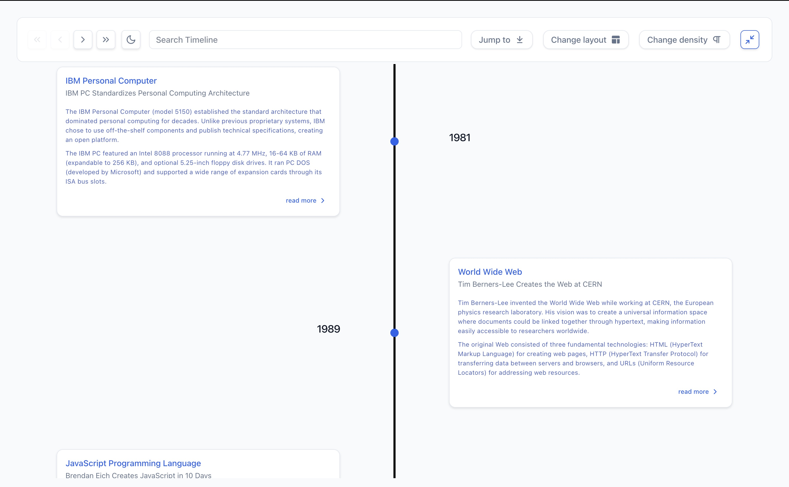
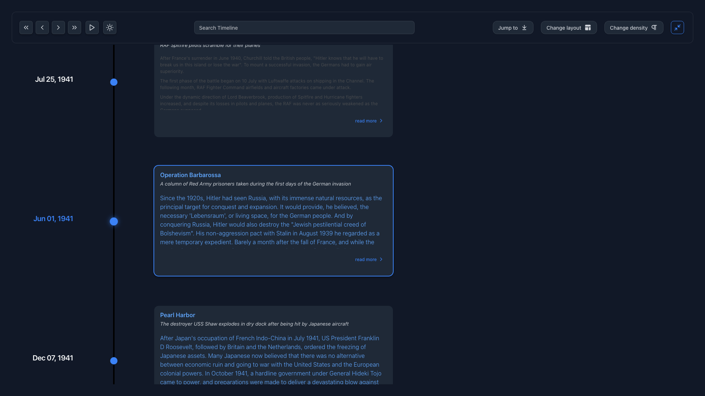
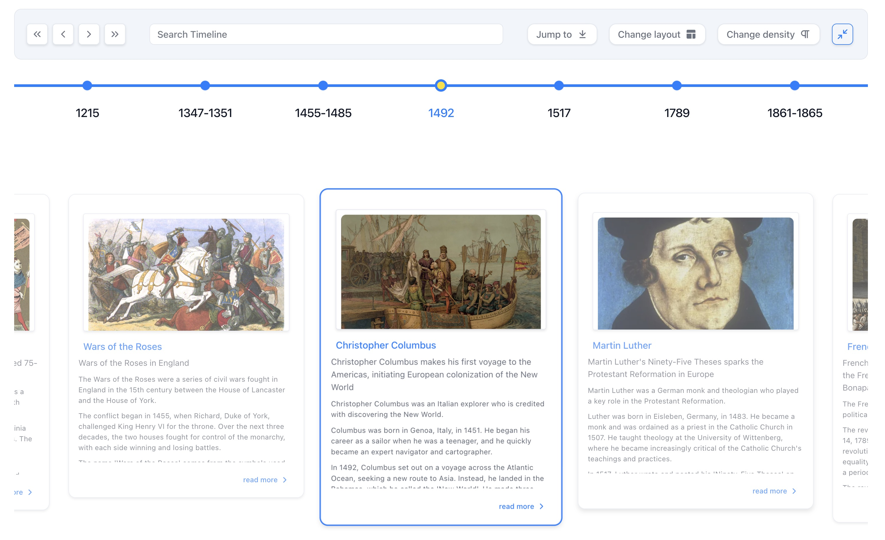
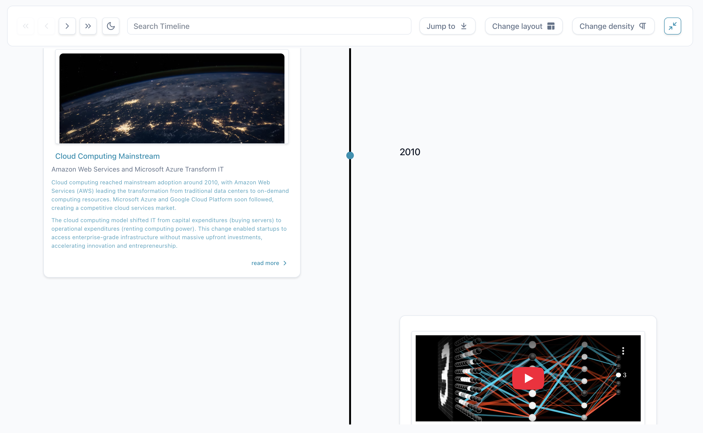

<div align="center">
  
  <!-- <h2>React Chrono</h2> -->
  <p><strong>The Ultimate Timeline Component for React Applications</strong></p>
  <p>Build stunning, interactive timelines with rich media support, accessibility-first design, and comprehensive customization options</p>
</div>

<div align="center">

[](https://www.npmjs.com/package/react-chrono) [](https://www.npmjs.com/package/react-chrono) [](https://bundlephobia.com/package/react-chrono) [](https://opensource.org/licenses/MIT) [](https://www.typescriptlang.org/)

[](https://dev.azure.com/prabhummurthy/react-chrono/_build/latest?definitionId=7&branchName=master) [](https://coveralls.io/github/prabhuignoto/react-chrono?branch=master) [](https://www.codacy.com/manual/prabhuignoto/react-chrono) [](https://snyk.io/test/github/prabhuignoto/react-chrono)

[](https://prettier.io/)[](https://reactjs.org/)

</div>

---

<table>
<tr>
<td align="center" valign="top">
<h3>Timeline Modes & Layouts</h3>
<p>4 Flexible Modes • Nested Timelines • Responsive</p>
</td>
<td align="center" valign="top">
<h3>Rich Media & Content</h3>
<p>Images • Videos • YouTube • Custom Components</p>
</td>
<td align="center" valign="top">
<h3>Theming & Customization</h3>
<p>Dark Mode • 36 Properties • Google Fonts</p>
</td>
</tr>
<tr>
<td align="center" valign="top">
<h3>Developer Experience</h3>
<p>TypeScript • Zero Dependencies • Vanilla Extract</p>
</td>
<td align="center" valign="top">
<h3>User Experience</h3>
<p>Slideshow • Search • Keyboard Navigation</p>
</td>
<td align="center" valign="top">
<h3>Accessibility & i18n</h3>
<p>WCAG AA • 60+ i18n Elements • Mobile First</p>
</td>
</tr>
</table>

---

## Table of Contents

<details open>
<summary><strong>Quick Start</strong></summary>

- [Installation](#installation)
- [Basic Usage](#basic-usage)
- [Visual Examples](#visual-examples)

</details>

<details open>
<summary><strong>Timeline Modes</strong></summary>

- [Mode Comparison](#timeline-modes)
- [Visual Examples](#visual-examples)
- [Use Case Guide](#use-case-guide)

</details>

<details open>
<summary><strong>Features</strong></summary>

- [Key Features](#key-features)
- [Rich Media Integration](#rich-media-integration)
- [Interactive Features](#interactive-features)
- [Theming & Customization](#theming--customization)
- [Internationalization](#internationalization)
- [Advanced Features](#advanced-features)

</details>

<details open>
<summary><strong>API & Documentation</strong></summary>

- [Essential Props](#essential-props)
- [Complete Props Reference](./PROPS-REFERENCE.md)
- [Migration from v2 to v3](#migration-from-v2-to-v3)
- [What's New in v3.0](#whats-new-in-v30)

</details>

<details open>
<summary><strong>Development</strong></summary>

- [Development Setup](#development-setup)
- [Contributing](#contributing)
- [Built With Modern Technologies](#built-with-modern-technologies)

</details>

---

## Quick Start

<div align="center">

**⚡ Get started in 30 seconds**

</div>

### Installation

```bash
# Using npm
npm install react-chrono

# Using yarn
yarn add react-chrono

# Using bun (recommended)
bun add react-chrono
```

**Requirements**: React 18.2+ or 19+ | Node.js 22+ | TypeScript 4.0+ (optional) | Modern browsers

### Basic Usage

**Minimal Setup - Your First Timeline**

```jsx
import { Chrono } from 'react-chrono';

const items = [
  { title: 'May 1940', cardTitle: 'Dunkirk', cardDetailedText: 'Allied evacuation from France' },
  { title: 'June 1944', cardTitle: 'D-Day', cardDetailedText: 'Normandy invasion begins' }
];

<Chrono items={items} />
```

**Result Preview:**



### Common Configurations

<details>
<summary><strong>Horizontal Timeline with Custom Theme</strong></summary>

```jsx
<Chrono
  items={items}
  mode="horizontal"
  theme={{ primary: '#0070f3', cardBgColor: '#f5f5f5' }}
/>
```

</details>

<details>
<summary><strong>Vertical Timeline with Media</strong></summary>

```jsx
const items = [
  {
    title: 'January 2024',
    cardTitle: 'Product Launch',
    cardDetailedText: 'Released version 3.0 with new features',
    media: {
      type: 'IMAGE',
      source: { url: 'https://example.com/launch.jpg' },
      name: 'Product launch event'
    }
  }
];

<Chrono items={items} mode="vertical" />
```

</details>

<details>
<summary><strong>Alternating Timeline with Slideshow</strong></summary>

```jsx
<Chrono
  items={items}
  mode="alternating"
  animation={{
    slideshow: {
      enabled: true,
      duration: 3000,
      type: 'fade'
    }
  }}
/>
```

</details>

### Advanced Configuration with Grouped API ✨

The new grouped API organizes configuration into logical sections:

```jsx
<Chrono
  items={items}
  mode="alternating"
  
  layout={{
    cardWidth: 450,
    cardHeight: 'auto',  // Automatic sizing based on content
    responsive: { enabled: true, breakpoint: 768 }
  }}
  
  content={{
    alignment: {
      horizontal: 'center',
      vertical: 'center'
    }
  }}
  
  interaction={{
    keyboardNavigation: true,
    pointClick: true,
    autoScroll: true
  }}
  
  display={{
    borderless: false,
    toolbar: { enabled: true, sticky: true }
  }}
  
  animation={{
    slideshow: { enabled: true, duration: 4000, type: 'fade' }
  }}
  
  theme={{
    primary: '#0070f3',
    cardBgColor: '#ffffff',
    cardTitleColor: '#1f2937'
  }}
/>
```

> **💡 Try it live**: Browse interactive examples in [Storybook](https://691574b1d6fa2f35b1f812a9-qukrtwoznl.chromatic.com/?path=/story/layout-modes-vertical--basic)

---

## Visual Examples

<div align="center">

**See React Chrono in action**

</div>

<table>
<tr>
<td width="50%">

**Vertical Mode**
Scroll-friendly chronological flow


</td>
<td width="50%">

**Alternating Mode**
Cards alternate left and right



</td>
</tr>
<tr>
<td width="50%">

**Dark Mode**
Complete theme control



</td>
<td width="50%">

**Horizontal All**
Dashboard view showing complete timeline



</td>
</tr>
<tr>
<td colspan="2" align="center">

**Timeline with Media**
Embed YouTube videos and images



</td>
</tr>
</table>

---

## Timeline Modes

React Chrono offers four layout modes, each optimized for specific use cases:

| Mode | Best For | Visual Style |
|------|----------|--------------|
| **Vertical** | Feeds, news timelines, mobile experiences | Top-to-bottom scroll-friendly layout |
| **Horizontal** | Historical narratives, project phases | Left-to-right chronological flow |
| **Alternating** | Portfolios, company milestones | Cards alternate left and right of central axis |
| **Horizontal All** | Dashboards, comparisons | Shows all timeline items at once |

### Use Case Guide

<details>
<summary><strong>📱 Mobile-First Content → Use Vertical Mode</strong></summary>

Perfect for feeds, news timelines, and mobile experiences where scrolling is natural.

```jsx
<Chrono items={items} mode="vertical" />
```

</details>

<details>
<summary><strong>📊 Historical Narratives → Use Horizontal Mode</strong></summary>

Ideal for historical narratives and project phases where the journey matters.

```jsx
<Chrono items={items} mode="horizontal" />
```

</details>

<details>
<summary><strong>💼 Portfolios & Milestones → Use Alternating Mode</strong></summary>

Great for portfolios and company milestones with balanced visual rhythm.

```jsx
<Chrono items={items} mode="alternating" />
```

</details>

<details>
<summary><strong>📈 Dashboards & Comparisons → Use Horizontal All</strong></summary>

Perfect for dashboards, comparisons, and seeing the complete picture at once.

```jsx
<Chrono items={items} mode="horizontal-all" />
```

</details>

---

## Key Features

### Rich Media Integration

<table>
<tr>
<td width="60%">

**Smart Loading & Performance**
- Images load only when entering viewport (intersection observers)
- Videos auto-play when timeline items become active
- Automatic responsive sizing and buffering
- Built-in accessibility attributes

</td>
<td width="40%">

```jsx
const items = [{
  title: 'Event',
  cardTitle: 'Media Example',
  media: {
    type: 'IMAGE',
    source: { url: 'image.jpg' }
  }
}];

<Chrono items={items} />
```

</td>
</tr>
</table>

### Interactive Features

<table>
<tr>
<td width="60%">

**Slideshow Mode**
Auto-playing presentations with customizable durations, transition effects, and progress indicators.

**Keyboard Navigation**
Full accessibility with arrow keys, Home/End for quick jumps, Escape for modals.

**Real-time Search**
Instantly highlights matching content across titles, descriptions, and metadata.

</td>
<td width="40%">

```jsx
<Chrono
  items={items}
  animation={{
    slideshow: {
      enabled: true,
      duration: 3000,
      type: 'fade'
    }
  }}
  interaction={{
    keyboardNavigation: true
  }}
  display={{
    toolbar: {
      enabled: true,
      search: { enabled: true }
    }
  }}
/>
```

</td>
</tr>
</table>

### Theming & Customization

<table>
<tr>
<td width="60%">

**Complete Theme Control**
- 36 customizable theme properties
- Dark mode with dedicated properties
- Google Fonts integration with automatic loading
- Per-element typography customization

</td>
<td width="40%">

```jsx
<Chrono
  items={items}
  theme={{
    primary: '#0070f3',
    cardBgColor: '#ffffff',
    cardTitleColor: '#1f2937',
    timelineBgColor: '#f5f5f5'
  }}
  darkMode={{ enabled: true }}
/>
```

</td>
</tr>
</table>

### Internationalization

<table>
<tr>
<td width="60%">

**Global Ready**
- 60+ configurable text elements
- Intelligent fallbacks
- Template strings with variable interpolation
- Full type safety

</td>
<td width="40%">

```jsx
<Chrono
  items={items}
  i18n={{
    texts: {
      navigation: {
        first: 'Premier élément',
        next: 'Suivant',
        previous: 'Précédent'
      },
      search: {
        placeholder: 'Rechercher',
        noResults: 'Aucun résultat'
      }
    }
  }}
/>
```

</td>
</tr>
</table>

### Advanced Features

<table>
<tr>
<td width="60%">

**Nested Timelines**
Create multi-level narratives where major events contain detailed sub-timelines.

**Custom Components**
Embed fully interactive React components within timeline cards.

**Responsive Design**
Fundamentally adapts to each device with smart font sizing and spacing.

</td>
<td width="40%">

```jsx
// Nested timeline example
const items = [{
  title: 'Major Event',
  cardTitle: 'Period',
  children: <Chrono items={subItems} />
}];

<Chrono items={items} />
```

</td>
</tr>
</table>

---

## Essential Props

React Chrono requires minimal configuration to get started:

| Property | Type | Description |
|----------|------|-------------|
| `items` | `TimelineItem[]` | Array of timeline data |
| `mode` | `string` | Layout mode: `'horizontal'` \| `'vertical'` \| `'alternating'` \| `'horizontal-all'` |
| `theme` | `Theme` | Customize colors and appearance |

**📚 Need complete prop documentation?** See our comprehensive [Props Reference](./PROPS-REFERENCE.md)

---

## Migration from v2 to v3

React Chrono v3.0 maintains **full backward compatibility** - your existing v2.x code will work without changes. However, we recommend migrating to the new grouped API for better maintainability and IDE support.

### Quick Migration

**v2.x (still works):**
```jsx
<Chrono 
  items={items}
  cardWidth={400}
  disableNavOnKey={false}
  borderLessCards={true}
  slideShow={true}
  slideItemDuration={3000}
  mediaHeight={400}
/>
```

**v3.0 (recommended):**
```jsx
<Chrono
  items={items}
  layout={{ cardWidth: 400 }}
  interaction={{ keyboardNavigation: true }}
  display={{ borderless: true }}
  animation={{
    slideshow: {
      enabled: true,
      duration: 3000
    }
  }}
  media={{ height: 400 }}
/>
```

### Common Prop Mappings

| v2.x Prop | v3.0 Prop |
|-----------|-----------|
| `borderLessCards` | `display.borderless` |
| `disableNavOnKey` | `interaction.keyboardNavigation` (inverted) |
| `timelinePointDimension` | `layout.pointSize` |
| `slideShow` | `animation.slideshow.enabled` |
| `slideItemDuration` | `animation.slideshow.duration` |
| `mediaHeight` | `media.height` |
| `parseDetailsAsHTML` | `content.allowHTML` |
| `disableToolbar` | `display.toolbar.enabled` (inverted) |

### What's New in v3.0

- 🎨 **Grouped API** - Props organized into logical groups (`layout`, `interaction`, `content`, `display`, `media`, `animation`)
- ⚡ **Zero-runtime CSS** - Migrated to Vanilla Extract for better performance
- 🌐 **i18n Support** - 60+ configurable text elements
- 🎭 **Google Fonts** - Per-element font control
- 🖼️ **Fullscreen Mode** - Cross-browser fullscreen support
- 📌 **Sticky Toolbar** - Always-accessible controls

**🔗 Complete migration guide**: [Props Reference](./PROPS-REFERENCE.md#-legacy-props-deprecated)

---

## What's New in v3.0

<div align="center">

**🎉 Major updates and improvements**

</div>

### Key Highlights

<table>
<tr>
<td width="33%">

**🏗️ Grouped API**
Props organized into logical groups (`layout`, `interaction`, `content`, `display`, `media`, `animation`, `style`, `accessibility`, `i18n`) for better IDE autocomplete

</td>
<td width="33%">

**⚡ Performance**
Complete migration to Vanilla Extract for zero-runtime CSS and improved performance

</td>
<td width="33%">

**🎨 New Features**
Auto card height, content alignment, Google Fonts, i18n support, fullscreen mode, and more

</td>
</tr>
</table>

**📋 Full changelog**: See [CHANGELOG.md](./CHANGELOG.md) for complete details

> **🔄 Backward Compatible**: All v2.x props remain fully supported with automatic mapping to the new grouped API

---

## Development Setup

### Prerequisites

- Node.js 22+
- bun (recommended) or npm

### Initial Setup

```bash
# Clone the repository
git clone https://github.com/prabhuignoto/react-chrono.git
cd react-chrono

# Install dependencies
bun install
```

### Development Commands

```bash
# Start development server with hot reload
bun run dev

# Build for production
bun run build

# Run unit tests
bun test

# Lint and format code
bun run clean
```

### Testing Framework

React Chrono uses a comprehensive testing approach:

- **Unit Tests**: Vitest with @testing-library/react

---

## Contributing

We welcome contributions! Please see our [Contributing Guide](./CONTRIBUTING.md) for details.

### Quick Contribution Checklist

- [ ] Fork the repo and create a feature branch
- [ ] Write tests for new features  
- [ ] Ensure all tests pass: `bun run find-bugs`
- [ ] Follow our code style: `bun run clean`
- [ ] Update documentation if needed
- [ ] Submit a pull request

---

## Built With Modern Technologies

<table>
<tr>
<td width="50%">

**Core Technologies**
- [React 18+](https://reactjs.org/) - Modern React features
- [TypeScript](https://www.typescriptlang.org/) - Type safety
- [Vanilla Extract](https://vanilla-extract.style/) - Zero-runtime CSS-in-JS
- [Day.js](https://day.js.org/) - Date manipulation

</td>
<td width="50%">

**Development Tools**
- [Vite](https://vitejs.dev/) - Fast bundling
- [Vitest](https://vitest.dev/) - Unit testing
- [ESLint](https://eslint.org/) & [Prettier](https://prettier.io/) - Code quality

</td>
</tr>
</table>

---

## Support the Project

<div align="center">

**Love React Chrono?** Help us grow!

⭐ [Star on GitHub](https://github.com/prabhuignoto/react-chrono) | 🐦 [Follow on Twitter](https://twitter.com/prabhumurthy2) | 🐛 [Report Issues](https://github.com/prabhuignoto/react-chrono/issues)

Made with ❤️ by [Prabhu Murthy](https://github.com/prabhuignoto) and [contributors](https://github.com/prabhuignoto/react-chrono/graphs/contributors)

</div>

---

<div align="center">
  
**[⬆ Back to Top](#react-chrono)**

</div>
