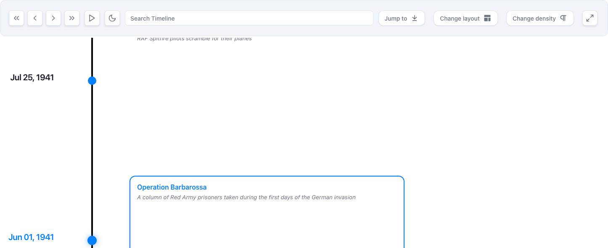
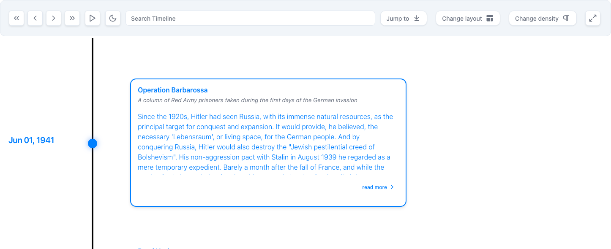
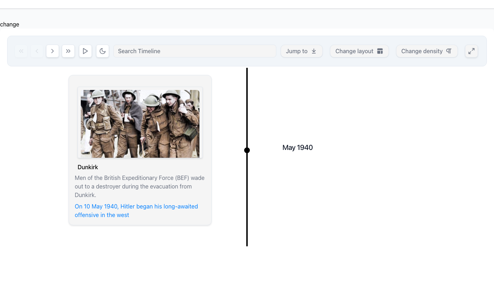

<div align="center">
  
  <h1>React Chrono</h1>
  <p><strong>The Ultimate Timeline Component for React Applications</strong></p>
  <p>Build stunning, interactive timelines with rich media support, accessibility-first design, and comprehensive customization options</p>
</div>

<div align="center">

[](https://www.npmjs.com/package/react-chrono) [](https://www.npmjs.com/package/react-chrono) [](https://bundlephobia.com/package/react-chrono) [](https://opensource.org/licenses/MIT) [](https://www.typescriptlang.org/)

[](https://dev.azure.com/prabhummurthy/react-chrono/_build/latest?definitionId=7&branchName=master) [](https://coveralls.io/github/prabhuignoto/react-chrono?branch=master) [](https://www.codacy.com/manual/prabhuignoto/react-chrono) [](https://snyk.io/test/github/prabhuignoto/react-chrono)

[](https://prettier.io/)[](https://reactjs.org/)

</div>

---

<div align="center">

<table style="border-collapse: separate; border-spacing: 12px; border: none;">
<tr>
<td align="center" width="33%" style="border: none;">
<div style="background: linear-gradient(135deg, #a8c0ff 0%, #c2e9fb 100%); padding: 18px 14px; border-radius: 8px; min-height: 100px; text-align: center; box-shadow: 0 2px 8px rgba(0, 0, 0, 0.08);">
<div style="margin-bottom: 10px;">
<svg width="32" height="32" viewBox="0 0 24 24" fill="none" stroke="#1e3a8a" stroke-width="2" stroke-linecap="round" stroke-linejoin="round"><rect x="3" y="3" width="7" height="7"></rect><rect x="14" y="3" width="7" height="7"></rect><rect x="14" y="14" width="7" height="7"></rect><rect x="3" y="14" width="7" height="7"></rect></svg>
</div>
<strong style="color: #1e3a8a; font-size: 15px; display: block; margin-bottom: 6px;">Timeline Modes & Layouts</strong>
<span style="color: #334155; font-size: 12.5px; line-height: 1.4;">4 Flexible Modes • Nested Timelines • Responsive</span>
</div>
</td>
<td align="center" width="33%" style="border: none;">
<div style="background: linear-gradient(135deg, #a7f3d0 0%, #d1fae5 100%); padding: 18px 14px; border-radius: 8px; min-height: 100px; text-align: center; box-shadow: 0 2px 8px rgba(0, 0, 0, 0.08);">
<div style="margin-bottom: 10px;">
<svg width="32" height="32" viewBox="0 0 24 24" fill="none" stroke="#065f46" stroke-width="2" stroke-linecap="round" stroke-linejoin="round"><rect x="2" y="2" width="20" height="20" rx="2.18" ry="2.18"></rect><line x1="7" y1="2" x2="7" y2="22"></line><line x1="17" y1="2" x2="17" y2="22"></line><line x1="2" y1="12" x2="22" y2="12"></line><line x1="2" y1="7" x2="7" y2="7"></line><line x1="2" y1="17" x2="7" y2="17"></line><line x1="17" y1="17" x2="22" y2="17"></line><line x1="17" y1="7" x2="22" y2="7"></line></svg>
</div>
<strong style="color: #065f46; font-size: 15px; display: block; margin-bottom: 6px;">Rich Media & Content</strong>
<span style="color: #334155; font-size: 12.5px; line-height: 1.4;">Images • Videos • YouTube • Custom Components</span>
</div>
</td>
<td align="center" width="33%" style="border: none;">
<div style="background: linear-gradient(135deg, #fecaca 0%, #fed7aa 100%); padding: 18px 14px; border-radius: 8px; min-height: 100px; text-align: center; box-shadow: 0 2px 8px rgba(0, 0, 0, 0.08);">
<div style="margin-bottom: 10px;">
<svg width="32" height="32" viewBox="0 0 24 24" fill="none" stroke="#7c2d12" stroke-width="2" stroke-linecap="round" stroke-linejoin="round"><path d="M12 2.69l5.66 5.66a8 8 0 1 1-11.31 0z"></path></svg>
</div>
<strong style="color: #7c2d12; font-size: 15px; display: block; margin-bottom: 6px;">Theming & Customization</strong>
<span style="color: #334155; font-size: 12.5px; line-height: 1.4;">Dark Mode • 36 Properties • Google Fonts</span>
</div>
</td>
</tr>
<tr>
<td align="center" width="33%" style="border: none;">
<div style="background: linear-gradient(135deg, #bfdbfe 0%, #ddd6fe 100%); padding: 18px 14px; border-radius: 8px; min-height: 100px; text-align: center; box-shadow: 0 2px 8px rgba(0, 0, 0, 0.08);">
<div style="margin-bottom: 10px;">
<svg width="32" height="32" viewBox="0 0 24 24" fill="none" stroke="#3730a3" stroke-width="2" stroke-linecap="round" stroke-linejoin="round"><polyline points="16 18 22 12 16 6"></polyline><polyline points="8 6 2 12 8 18"></polyline></svg>
</div>
<strong style="color: #3730a3; font-size: 15px; display: block; margin-bottom: 6px;">Developer Experience</strong>
<span style="color: #334155; font-size: 12.5px; line-height: 1.4;">TypeScript • Zero Dependencies • Vanilla Extract</span>
</div>
</td>
<td align="center" width="33%" style="border: none;">
<div style="background: linear-gradient(135deg, #fbcfe8 0%, #fae8ff 100%); padding: 18px 14px; border-radius: 8px; min-height: 100px; text-align: center; box-shadow: 0 2px 8px rgba(0, 0, 0, 0.08);">
<div style="margin-bottom: 10px;">
<svg width="32" height="32" viewBox="0 0 24 24" fill="none" stroke="#831843" stroke-width="2" stroke-linecap="round" stroke-linejoin="round"><path d="M17 21v-2a4 4 0 0 0-4-4H5a4 4 0 0 0-4 4v2"></path><circle cx="9" cy="7" r="4"></circle><path d="M23 21v-2a4 4 0 0 0-3-3.87"></path><path d="M16 3.13a4 4 0 0 1 0 7.75"></path></svg>
</div>
<strong style="color: #831843; font-size: 15px; display: block; margin-bottom: 6px;">User Experience</strong>
<span style="color: #334155; font-size: 12.5px; line-height: 1.4;">Slideshow • Search • Keyboard Navigation</span>
</div>
</td>
<td align="center" width="33%" style="border: none;">
<div style="background: linear-gradient(135deg, #fef3c7 0%, #fde68a 100%); padding: 18px 14px; border-radius: 8px; min-height: 100px; text-align: center; box-shadow: 0 2px 8px rgba(0, 0, 0, 0.08);">
<div style="margin-bottom: 10px;">
<svg width="32" height="32" viewBox="0 0 24 24" fill="none" stroke="#78350f" stroke-width="2" stroke-linecap="round" stroke-linejoin="round"><path d="m12 3-1.912 5.813a2 2 0 0 1-1.275 1.275L3 12l5.813 1.912a2 2 0 0 1 1.275 1.275L12 21l1.912-5.813a2 2 0 0 1 1.275-1.275L21 12l-5.813-1.912a2 2 0 0 1-1.275-1.275L12 3Z"></path><path d="M5 3v4"></path><path d="M19 17v4"></path><path d="M3 5h4"></path><path d="M17 19h4"></path></svg>
</div>
<strong style="color: #78350f; font-size: 15px; display: block; margin-bottom: 6px;">Accessibility & i18n</strong>
<span style="color: #334155; font-size: 12.5px; line-height: 1.4;">WCAG AA • 40+ i18n Elements • Mobile First</span>
</div>
</td>
</tr>
</table>

</div>

---

## Table of Contents

<details>
<summary><strong>Quick Start</strong></summary>

- [What's New in v3.0](#whats-new-in-v30)
- [Installation](#installation)
- [Basic Usage](#basic-usage)
- [Timeline Modes](#timeline-modes)

</details>

<details>
<summary><strong>API Documentation</strong></summary>

- [Essential Props](#essential-props)
- [Complete Props Reference](./PROPS-REFERENCE.md)
- [Migration from v2 to v3](#migration-from-v2-to-v3)

</details>

<details>
<summary><strong>Features & Customization</strong></summary>

- [Showcase: What React Chrono Can Do](#showcase-what-react-chrono-can-do)
- [Rich Media Integration](#rich-media-integration)
- [Interactive Features](#interactive-features)
- [Theming & Branding](#theming--branding)
- [Complete Internationalization](#complete-internationalization)
- [Advanced Architecture](#advanced-architecture)
- [Responsive Design](#responsive-design)

</details>


<details>
<summary><strong>Examples & Development</strong></summary>

- [Live Examples & Playground](#live-examples--playground)
  - [CodeSandbox Examples Collection](#codesandbox-examples-collection)
- [Development Setup](#development-setup)
- [Contributing](#contributing)
- [Built With Modern Technologies](#built-with-modern-technologies)

</details>

---

## What's New in v3.0

React Chrono v3.0 represents a complete evolution of the timeline component with architectural improvements and powerful new features:

### Architectural Overhaul
- **Grouped Configuration API** - Props organized into logical groups (`layout`, `interaction`, `content`, `display`, `media`, `animation`, `style`, `accessibility`, `i18n`) for intuitive configuration and better IDE autocomplete
- **Vanilla Extract Migration** - Complete migration from styled-components to Vanilla Extract for zero-runtime CSS, improved performance, and type-safe styling
- **Unified Context System** - Streamlined from multiple contexts to a single optimized provider, reducing complexity and improving performance

### New Features
- **Auto Card Height** - `cardHeight: 'auto'` for content-based sizing
- **Content Alignment** - Horizontal and vertical alignment control within cards
- **Google Fonts** - Dynamic font loading with per-element customization
- **i18n Support** - 40+ configurable text elements for global applications
- **Fullscreen Mode** - Cross-browser support with keyboard shortcuts
- **Enhanced Dark Mode** - 36 theme properties for complete customization
- **Sticky Toolbar** - Optional sticky positioning with configurable placement
- **Borderless Cards** - Minimal card variant for modern designs
- **Advanced Search** - Customizable search input sizing and positioning

### UX Improvements
- **Responsive Popovers** - Smart positioning that adapts to fullscreen mode
- **Enhanced Navigation** - Keyboard support with improved focus management
- **Text Density** - Compact and detailed view options for different use cases
- **Smooth Animations** - Refined transitions and interactions

### Quality Assurance
- **Component Testing** - Isolated tests with visual regression checks
- **Integration Tests** - Build output validation and cross-browser testing

### Developer Experience
- **TypeScript First** - Full type definitions and IntelliSense support
- **Comprehensive Docs** - Props reference and migration guides
- **Interactive Examples** - Live CodeSandbox and Storybook demos

All v2.x props remain fully supported with automatic mapping to the new grouped API, ensuring seamless upgrades without breaking changes.

---

## Quick Start

### Installation

Get started with React Chrono in seconds:

```bash
# Using npm
npm install react-chrono

# Using yarn
yarn add react-chrono

# Using pnpm (recommended)
pnpm add react-chrono
```

**Requirements**: React 18.2+ | TypeScript 4.0+ (optional) | Modern browsers

## Basic Usage

### Minimal Setup - Your First Timeline

Get started with just two lines of code:

```jsx
import { Chrono } from 'react-chrono';

const items = [
  { title: 'May 1940', cardTitle: 'Dunkirk', cardDetailedText: 'Allied evacuation from France' },
  { title: 'June 1944', cardTitle: 'D-Day', cardDetailedText: 'Normandy invasion begins' }
];

<Chrono items={items} />
```

### Common Configurations

**Horizontal Timeline with Custom Theme**
```jsx
<Chrono
  items={items}
  mode="horizontal"
  theme={{ primary: '#0070f3', cardBgColor: '#f5f5f5' }}
/>
```

**Vertical Timeline with Media**
```jsx
const items = [
  {
    title: 'January 2024',
    cardTitle: 'Product Launch',
    cardDetailedText: 'Released version 3.0 with new features',
    media: {
      type: 'IMAGE',
      source: { url: 'https://example.com/launch.jpg' },
      name: 'Product launch event'
    }
  }
];

<Chrono items={items} mode="vertical" />
```

**Alternating Timeline with Slideshow**
```jsx
<Chrono
  items={items}
  mode="alternating"
  animation={{
    slideshow: {
      enabled: true,
      duration: 3000,
      type: 'fade'
    }
  }}
/>
```

### Advanced Configuration with Grouped API ✨

The new grouped API organizes configuration into logical sections for better discoverability and maintainability:

```jsx
<Chrono
  items={items}
  mode="alternating"

  layout={{
    cardWidth: 450,
    cardHeight: 'auto',  // NEW: Automatic sizing based on content
    responsive: { enabled: true, breakpoint: 768 }
  }}

  content={{
    alignment: {  // NEW: Control content alignment
      horizontal: 'center',
      vertical: 'center'
    }
  }}

  interaction={{
    keyboardNavigation: true,
    pointClick: true,
    autoScroll: true
  }}

  display={{
    borderless: false,
    toolbar: { enabled: true, sticky: true }
  }}

  animation={{
    slideshow: { enabled: true, duration: 4000, type: 'fade' }
  }}

  theme={{
    primary: '#0070f3',
    cardBgColor: '#ffffff',
    cardTitleColor: '#1f2937'
  }}
/>
```

**Quick Start Examples by Use Case:**

```jsx
// Corporate Timeline
<Chrono items={milestones} mode="horizontal" theme={{ primary: '#1a73e8' }} />

// Project Roadmap
<Chrono
  items={tasks}
  mode="vertical"
  display={{ toolbar: { enabled: true, sticky: true } }}
/>

// Photo Timeline with Auto Height
<Chrono
  items={memories}
  mode="alternating"
  layout={{ cardHeight: 'auto' }}  // Cards size automatically to content
  media={{ height: 300, fit: 'cover' }}
/>

// Documentation Timeline
<Chrono
  items={releases}
  mode="vertical"
  content={{ allowHTML: true, readMore: true }}
/>
```

> **🚀 Migration Made Easy**: All existing v2.x props work alongside the new grouped API for seamless upgrades.

## Timeline Modes

React Chrono offers four thoughtfully designed layout modes, each optimized for specific content types and user experiences:

### Horizontal Mode
Left-to-right chronological flow. Ideal for historical narratives and project phases where the journey matters.

### Vertical Mode
Top-to-bottom scroll-friendly layout. Perfect for feeds, news timelines, and mobile experiences.

### Alternating Mode
Cards alternate left and right of a central axis. Great for portfolios and company milestones with balanced visual rhythm.

### Horizontal All
Shows all timeline items at once. Perfect for dashboards, comparisons, and seeing the complete picture.

#### Visual Examples

**Vertical Mode** - Scroll-friendly chronological flow:


**Vertical Mode (High Text Density)** - Compact view showing detailed information:


**Alternating Mode** - Cards alternate left and right with visual balance:


**Dark Mode** - Complete theme control with 36 customizable properties:


**Horizontal All** - Dashboard view showing complete timeline:


---

## Essential Props

React Chrono requires minimal configuration to get started:

| Property | Type | Description |
|----------|------|-------------|
| `items` | `TimelineItem[]` | Array of timeline data |
| `mode` | `string` | Layout mode: `'horizontal'` \| `'vertical'` \| `'alternating'` \| `'horizontal-all'` |
| `theme` | `Theme` | Customize colors and appearance |

**Need complete prop documentation?** See our comprehensive [Props Reference](./PROPS-REFERENCE.md)

---

## Showcase: What React Chrono Can Do

### Rich Media Integration

Images load intelligently using intersection observers - only when entering the viewport - ensuring fast initial loads even with dozens of high-resolution photos. Videos auto-play when timeline items become active, creating cinematic storytelling experiences. The component handles responsive sizing, buffering states, accessibility attributes, and performance optimization automatically.

### Interactive Features

**Slideshow Mode**: Auto-playing presentations with customizable durations, transition effects, and progress indicators - perfect for kiosks and guided storytelling.

**Keyboard Navigation**: Full accessibility with arrow keys for navigation, Home/End for quick jumps to first/last items, and Escape for closing modals. Smooth animations respect user motion preferences.

**Real-time Search**: Instantly highlights matching content across titles, descriptions, and metadata, helping users find specific events without losing context.

### Theming & Branding

Adapt to any visual identity with a comprehensive theming system. Dark mode is a first-class feature with dedicated properties for shadows, glows, and interaction states. Google Fonts integration handles loading optimization and fallback strategies automatically, making typography customization effortless.

### Complete Internationalization

Customize every piece of user-facing text for any language or locale. The i18n system uses intelligent fallbacks - configure only what you need to change. Template strings support variable interpolation with full type safety.

```jsx
<Chrono
  items={items}
  i18n={{
    texts: {
      navigation: { first: 'Premier élément', next: 'Suivant', previous: 'Précédent' },
      search: { placeholder: 'Rechercher dans la chronologie', noResults: 'Aucun résultat trouvé' }
    }
  }}
/>
```

### Advanced Architecture

**Nested Timelines**: Create multi-level narratives where major events contain detailed sub-timelines - ideal for historical periods, project phases, or biographical chapters.

**Custom Components**: Embed fully interactive React components within timeline cards - data visualizations, interactive maps, widgets, or custom UI elements.

### Responsive Design

Fundamentally adapts to each device: precision hover states and multi-column layouts on desktop, optimized touch targets on tablets, and content-prioritized interfaces on mobile with smart font sizing and spacing.

---

## Migration from v2 to v3

Upgrading is seamless with full backward compatibility:

```jsx
// ✅ Both syntaxes work
<Chrono 
  cardWidth={400}           // Legacy prop
  disableNavOnKey={false}   // Legacy prop
  theme={{ primary: '#blue' }}
/>

// 🚀 New grouped API (recommended)
<Chrono
  layout={{ cardWidth: 400 }}
  interaction={{ keyboardNavigation: true }}
  theme={{ primary: '#blue' }}
/>
```

**🔗 Complete migration guide**: [Props Reference](./PROPS-REFERENCE.md#migration-from-v1)

---

## Live Examples & Playground

### CodeSandbox Examples

Try interactive examples with real-time editing:

1. [**Quick Start**](https://codesandbox.io/p/github/prabhuignoto/react-chrono/feat/comprehensive-examples-storybook/codesandbox-examples/01-quick-start) - Basic vertical timeline for beginners
2. [**Product Roadmap**](https://codesandbox.io/p/github/prabhuignoto/react-chrono/feat/comprehensive-examples-storybook/codesandbox-examples/02-product-roadmap) - Horizontal timeline with slideshow
3. [**Media Gallery**](https://codesandbox.io/p/github/prabhuignoto/react-chrono/feat/comprehensive-examples-storybook/codesandbox-examples/03-media-gallery) - Alternating layout with images
4. [**Nested Timeline**](https://codesandbox.io/p/github/prabhuignoto/react-chrono/feat/comprehensive-examples-storybook/codesandbox-examples/04-nested-timeline) - Hierarchical project structure
5. [**Dark Portfolio**](https://codesandbox.io/p/github/prabhuignoto/react-chrono/feat/comprehensive-examples-storybook/codesandbox-examples/05-dark-portfolio) - Horizontal-all mode with dark theme
6. [**Full Feature Demo**](https://codesandbox.io/p/github/prabhuignoto/react-chrono/feat/comprehensive-examples-storybook/codesandbox-examples/06-full-demo) - Comprehensive v3.0 showcase

### Storybook Documentation

Browse component stories and interactive documentation on [Chromatic](https://chromatic.com).

### Local Demo Site
Explore our comprehensive demo site with interactive examples. Run `pnpm run dev` locally to access:
- All timeline layout modes (horizontal, vertical, alternating, horizontal-all)
- Dark mode theming examples
- Google Fonts integration demos
- Internationalization samples
- Media-rich timelines
- Custom content examples
- Nested timeline structures

---

## Development Setup

### Prerequisites

- Node.js 18+
- pnpm (recommended) or npm

### Initial Setup

```bash
# Clone the repository
git clone https://github.com/prabhuignoto/react-chrono.git
cd react-chrono

# Install dependencies
pnpm install
```

### Development Commands

```bash
# Start development server with hot reload
pnpm run dev

# Build for production
pnpm run build

# Run unit tests
pnpm test

# Lint and format code
pnpm run clean

```

### Testing Framework

React Chrono uses a comprehensive testing approach:

- **Unit Tests**: Vitest with @testing-library/react

---

## Contributing

We welcome contributions! Please see our [Contributing Guide](./CONTRIBUTING.md) for details.

### Quick Contribution Checklist

- [ ] Fork the repo and create a feature branch
- [ ] Write tests for new features  
- [ ] Ensure all tests pass: `pnpm run find-bugs`
- [ ] Follow our code style: `pnpm run clean`
- [ ] Update documentation if needed
- [ ] Submit a pull request

---

## Built With Modern Technologies

<table>
<tr>
<td width="50%">

**Core Technologies**
- [React 18+](https://reactjs.org/) - Modern React features
- [TypeScript](https://www.typescriptlang.org/) - Type safety
- [Vanilla Extract](https://vanilla-extract.style/) - Zero-runtime CSS-in-JS
- [Day.js](https://day.js.org/) - Date manipulation

</td>
<td width="50%">

**Development Tools**
- [Vite](https://vitejs.dev/) - Fast bundling
- [Vitest](https://vitest.dev/) - Unit testing
- [ESLint](https://eslint.org/) & [Prettier](https://prettier.io/) - Code quality

</td>
</tr>
</table>

---

## Support the Project

<div align="center">

**Love React Chrono?** Help us grow!

⭐ [Star on GitHub](https://github.com/prabhuignoto/react-chrono) | 🐦 [Follow on Twitter](https://twitter.com/prabhumurthy2) | 🐛 [Report Issues](https://github.com/prabhuignoto/react-chrono/issues)

Made with ❤️ by [Prabhu Murthy](https://github.com/prabhuignoto) and [contributors](https://github.com/prabhuignoto/react-chrono/graphs/contributors)

</div>

---

<div align="center">
  
**[⬆ Back to Top](#react-chrono)**

</div>
