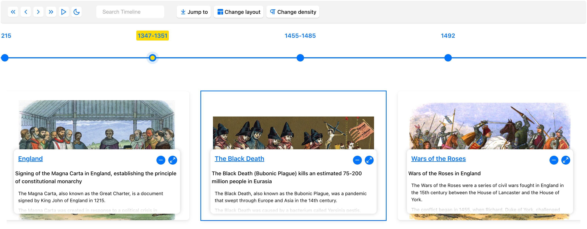
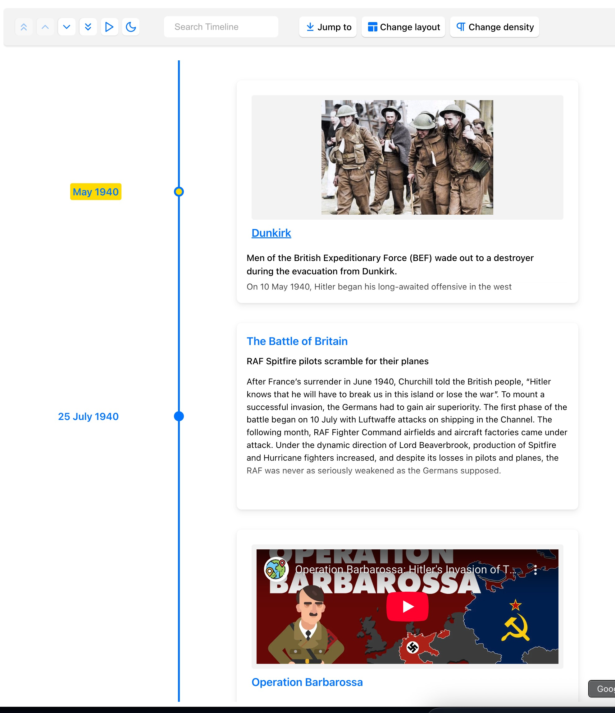
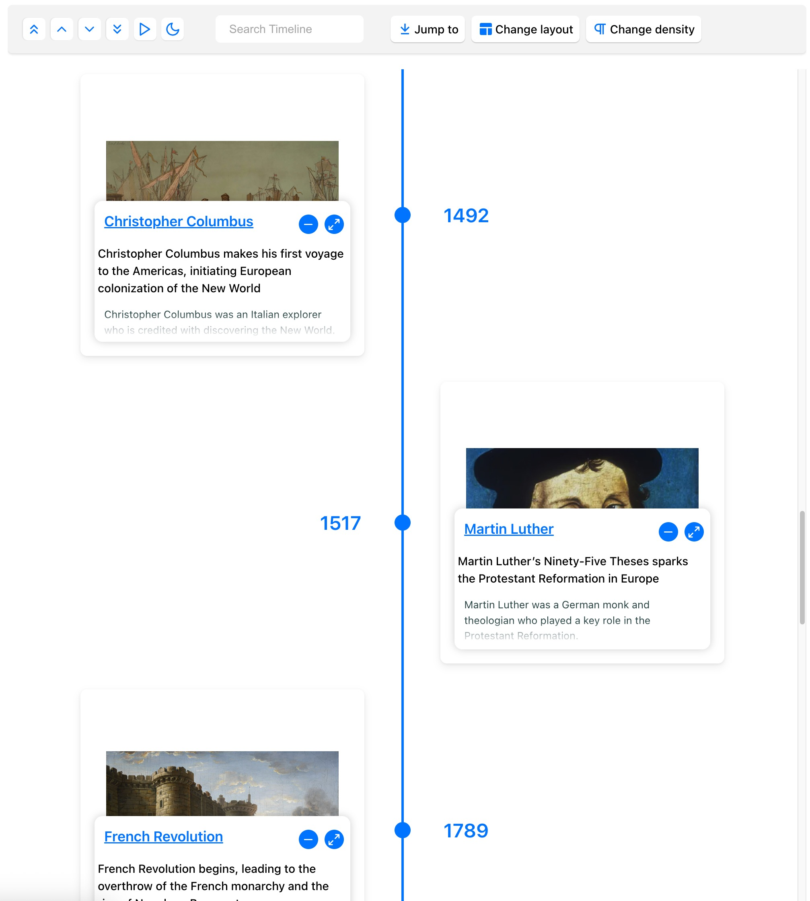
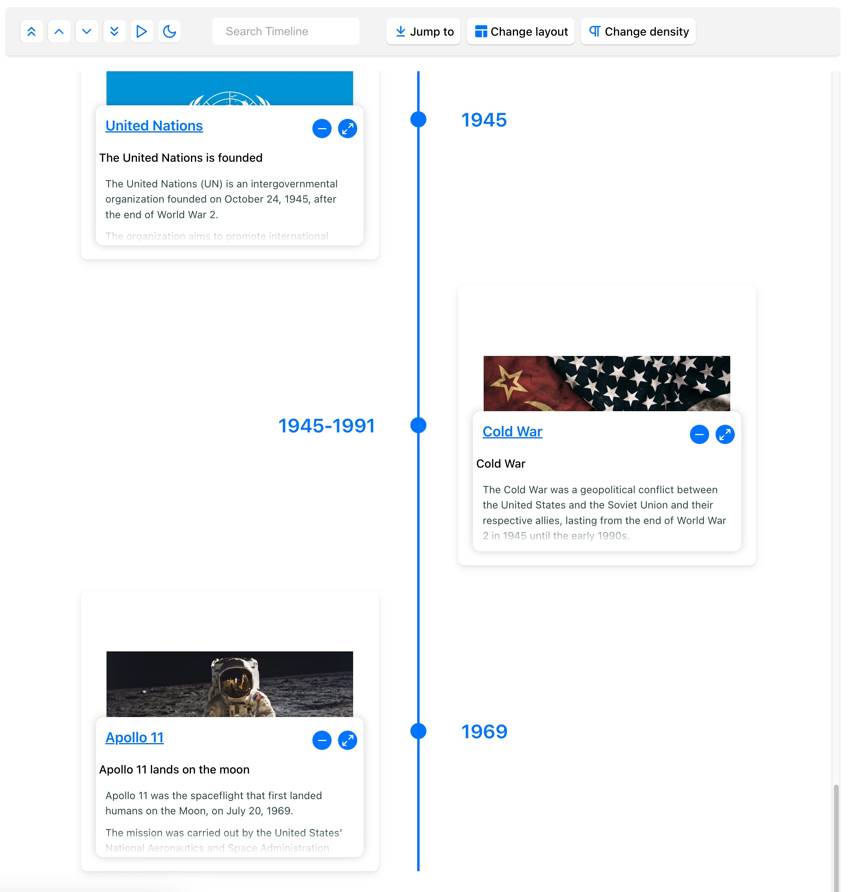

<div align="center">
  
  <h1>React Chrono</h1>
  <p>A flexible and modern timeline component for React.</p>
</div>

<div align="center">

[](https://www.npmjs.com/package/react-chrono)


[](https://opensource.org/licenses/MIT)
[](https://prettier.io/)

<!-- Build & Quality Badges -->

[](https://dev.azure.com/prabhummurthy/react-chrono/_build/latest?definitionId=7&branchName=master)
[](https://deepscan.io/dashboard#view=project&tid=10074&pid=13644&bid=234929)
[](https://www.codacy.com/manual/prabhuignoto/react-chrono?utm_source=github.com&utm_medium=referral&utm_content=prabhuignoto/react-chrono&utm_campaign=Badge_Grade)
[](https://snyk.io/test/github/prabhuignoto/react-chrono)
[](https://depfu.com/github/prabhuignoto/react-chrono?project_id=15325)
[](https://coveralls.io/github/prabhuignoto/react-chrono?branch=master)
<a href="https://5f985eb478dcb00022cfd60e-axcjutcmmg.chromatic.com/?path=/story/example-vertical--vertical-basic" target="_blank"></a>

</div>

<!-- **Try it on CodeSandbox!**
[](https://codesandbox.io/s/react-chrono-bg56e?fontsize=14&hidenavigation=1&theme=dark) -->

React Chrono is a modern timeline component for React that offers a variety of features and customization options. It allows you to render timelines in horizontal, vertical, vertical-alternating, and horizontal-all modes, display images and videos, and much more.

**🚀 Recent Enhancements:**
- **🎯 New Grouped API**: Cleaner, more intuitive prop structure with logical groupings
- **🔄 Backward Compatibility**: Seamless migration from old to new API with deprecation warnings
- **🏗️ Better Architecture**: Improved type safety and development experience
- **⚡ Enhanced Performance**: Optimized prop handling and validation
- **📚 Cleaner Documentation**: Organized by feature groups for better understanding
- **🧪 Modern Testing**: Comprehensive Playwright E2E testing (Cypress removed)

## Table of Contents

- [✨ Features](#-features)
- [💾 Installation](#-installation)
- [🚀 Getting Started](#-getting-started)
  - [Basic Horizontal Mode](#basic-horizontal-mode)
  - [Vertical Mode](#vertical-mode)
  - [Vertical Alternating Mode](#vertical-alternating-mode)
- [🎯 New Grouped API Structure](#-new-grouped-api-structure)
  - [Basic Usage with New API](#basic-usage-with-new-api)
  - [Configuration Groups](#configuration-groups)
  - [Migration from Old API](#migration-from-old-api)
- [⚙️ Props Reference](#️-props-reference)
  - [Core Props](#core-props)
  - [Configuration Objects](#configuration-objects)
  - [Timeline Item Model](#timeline-item-model)
- [🎨 Customization](#-customization)
  - [Rendering Custom Content](#rendering-custom-content-1)
  - [Custom Icons](#custom-icons)
  - [Nested Timelines](#nested-timelines-1)
  - [Custom Class Names](#custom-class-names)
  - [Custom Font Sizes](#custom-font-sizes)
  - [Custom Button Alt Text](#custom-button-alt-text)
- [📦 Examples & Demos](#-examples--demos)
  - [CodeSandbox Examples](#codesandbox-examples)
  - [Storybook](#storybook)
- [🛠️ Development & Build Commands](#️-development--build-commands)
  - [Initial Setup](#initial-setup)
  - [Development Commands](#development-commands)
  - [Testing Commands](#testing-commands)
  - [Code Quality Commands](#code-quality-commands)
  - [Bundle & Security Commands](#bundle--security-commands)
  - [Most Used Development Workflow](#most-used-development-workflow)
- [🧪 Testing Framework](#-testing-framework)
- [🤝 Contributing](#-contributing)
- [🧱 Built With](#-built-with)
- [💖 Support & Meta](#-support--meta)
- [✨ Contributors](#-contributors)

## ✨ Features

- 🚥 **Multiple Modes**: Render timelines in Horizontal, Vertical, or Vertical-Alternating layouts.
- 📺 **Slideshow**: Auto-play the timeline with slideshow functionality.
- 🖼️ **Media Support**: Easily display images and videos within timeline cards.
- ⌨️ **Keyboard Accessible**: Navigate the timeline using keyboard controls.
- 🔧 **Custom Content**: Render custom React components within timeline cards.
- 🌿 **Nested Timelines**: Display timelines within timeline cards for complex narratives.
- ⚡ **Data-Driven API**: Configure the timeline dynamically using a simple data structure.
- 🎨 **Enhanced Theming**: Comprehensive theme customization with **15+ new dark mode properties** for complete visual control.
- 🌙 **Advanced Dark Mode**: Fully configurable dark mode with brand color integration and accessibility compliance.
- 🎭 **Custom Icons**: Use your own icons for timeline points.
- 🔍 **Advanced Search**: Built-in search functionality with keyboard navigation and match highlighting.
- 📱 **Fullscreen Support**: Enter fullscreen mode for immersive timeline viewing with cross-browser compatibility.
- 🎯 **Focus Management**: Improved focus states and keyboard navigation for accessibility.
- ⚙️ **Flexible Layouts**: Dynamic layout switching between modes with responsive breakpoints.
- 🎬 **Enhanced Slideshow**: Multiple animation types with overall progress tracking.
- 💪 **TypeScript**: Built with TypeScript for robust development.
- 💅 **Styled with Styled Component**: Leverages Styled Component for flexible styling.

## 💾 Installation

```bash
# Using yarn
yarn add react-chrono

# Using npm
npm install react-chrono
```

## 🚀 Getting Started

Ensure you wrap the `Chrono` component in a container with a specified `width` and `height`.

### Basic Horizontal Mode

By default, if no `mode` is specified, the component renders in `HORIZONTAL` mode.

```jsx
import React from 'react';
import { Chrono } from 'react-chrono';

const App = () => {
  const items = [
    {
      title: 'May 1940',
      cardTitle: 'Dunkirk',
      url: 'http://www.history.com',
      cardSubtitle:
        'Men of the British Expeditionary Force (BEF) wade out to a destroyer...',
      cardDetailedText:
        'Men of the British Expeditionary Force (BEF) wade out to a destroyer during the evacuation from Dunkirk.',
      media: {
        type: 'IMAGE',
        source: {
          url: 'http://someurl/image.jpg',
        },
      },
    },
    // ... more items
  ];

  return (
    <div style={{ width: '800px', height: '400px' }}>
      <Chrono items={items} />
    </div>
  );
};

export default App;
```



### Vertical Mode

To render the timeline vertically, set the `mode` prop to `VERTICAL`.

```jsx
<div style={{ width: '300px', height: '950px' }}>
  <Chrono items={items} mode="VERTICAL" />
</div>
```



### Vertical Alternating Mode

For a layout where cards alternate sides, use `VERTICAL_ALTERNATING`.

```jsx
<div style={{ width: '500px', height: '950px' }}>
  <Chrono items={items} mode="VERTICAL_ALTERNATING" />
</div>
```



## 🎯 New Grouped API Structure

React Chrono now offers a cleaner, more intuitive API with logically grouped configuration objects. This makes it easier to understand and configure the timeline while maintaining full backward compatibility.

### Basic Usage with New API

```jsx
import { Chrono } from 'react-chrono';

const App = () => {
  const items = [
    {
      title: 'May 1940',
      cardTitle: 'Dunkirk',
      cardSubtitle: 'Evacuation of Allied soldiers',
      cardDetailedText: 'Men of the British Expeditionary Force...',
    },
    // ... more items
  ];

  return (
    <div style={{ width: '800px', height: '600px' }}>
      <Chrono
        items={items}
        mode="alternating"
        layout={{
          cardWidth: 400,
          cardHeight: 200,
          pointSize: 20,
        }}
        interaction={{
          keyboardNavigation: true,
          pointClick: true,
          autoScroll: true,
        }}
        display={{
          borderless: false,
          pointShape: 'circle',
          toolbar: { enabled: true, position: 'top' },
        }}
        animation={{
          slideshow: {
            enabled: true,
            duration: 3000,
            showProgress: true,
          },
        }}
        theme={{
          primary: '#0070f3',
          cardBgColor: '#ffffff',
          titleColor: '#333333',
        }}
      />
    </div>
  );
};
```

### Configuration Groups

The new API organizes props into logical groups:

- **`layout`** - Sizing, positioning, and responsive behavior
- **`interaction`** - User interaction and navigation options
- **`content`** - Text handling, HTML parsing, and semantic tags
- **`display`** - Visual appearance, borders, points, and toolbar
- **`media`** - Image and video configuration
- **`animation`** - Slideshow and transition effects
- **`style`** - Custom CSS classes and font sizes
- **`accessibility`** - Button labels and ARIA support

### Migration from Old API

The new API is fully backward compatible. Existing code will continue to work with deprecation warnings in development:

```jsx
// ✅ Old API - Still works with deprecation warnings
<Chrono
  items={items}
  borderLessCards={true}           // ⚠️ Deprecated
  disableNavOnKey={false}          // ⚠️ Deprecated
  timelinePointDimension={18}      // ⚠️ Deprecated
/>

// ✅ New API - Recommended
<Chrono
  items={items}
  display={{ borderless: true }}
  interaction={{ keyboardNavigation: true }}
  layout={{ pointSize: 18 }}
/>
```

### ⚡ Quick Migration Guide

Here's how common prop patterns map to the new API:

#### Layout & Sizing
```jsx
// Old API ❌
<Chrono
  cardWidth={400}
  cardHeight={200}
  timelinePointDimension={16}
  lineWidth={3}
  itemWidth={300}
  responsiveBreakPoint={768}
  enableBreakPoint={true}
  cardPositionHorizontal="TOP"
  flipLayout={true}
/>

// New API ✅
<Chrono
  layout={{
    cardWidth: 400,
    cardHeight: 200,
    pointSize: 16,
    lineWidth: 3,
    itemWidth: 300,
    responsive: {
      breakpoint: 768,
      enabled: true,
    },
    positioning: {
      cardPosition: 'top',
      flipLayout: true,
    },
  }}
/>
```

#### Interaction & Navigation
```jsx
// Old API ❌
<Chrono
  disableNavOnKey={false}
  disableClickOnCircle={false}
  disableAutoScrollOnClick={false}
  focusActiveItemOnLoad={true}
  highlightCardsOnHover={true}
  disableInteraction={false}
/>

// New API ✅
<Chrono
  interaction={{
    keyboardNavigation: true,
    pointClick: true,
    autoScroll: true,
    focusOnLoad: true,
    cardHover: true,
    disabled: false,
  }}
/>
```

#### Display & Visual
```jsx
// Old API ❌
<Chrono
  borderLessCards={true}
  cardLess={false}
  disableTimelinePoint={false}
  timelinePointShape="circle"
  showAllCardsHorizontal={false}
  disableToolbar={false}
  toolbarPosition="top"
  scrollable={{ scrollbar: false }}
/>

// New API ✅
<Chrono
  display={{
    borderless: true,
    cardsDisabled: false,
    pointsDisabled: false,
    pointShape: 'circle',
    allCardsVisible: false,
    toolbar: {
      enabled: true,
      position: 'top',
    },
    scrollable: { scrollbar: false },
  }}
/>
```

#### Content & Media
```jsx
// Old API ❌
<Chrono
  parseDetailsAsHTML={true}
  useReadMore={true}
  textOverlay={false}
  titleDateFormat="MMM DD, YYYY"
  textDensity="HIGH"
  mediaHeight={200}
  mediaSettings={{
    align: 'center',
    fit: 'cover',
  }}
/>

// New API ✅
<Chrono
  content={{
    allowHTML: true,
    readMore: true,
    textOverlay: false,
    dateFormat: 'MMM DD, YYYY',
    compactText: true,
  }}
  media={{
    height: 200,
    align: 'center',
    fit: 'cover',
  }}
/>
```

#### Slideshow & Animation
```jsx
// Old API ❌
<Chrono
  slideShow={true}
  slideItemDuration={2000}
  slideShowType="slide_from_sides"
  showProgressOnSlideshow={true}
  showOverallSlideshowProgress={true}
/>

// New API ✅
<Chrono
  animation={{
    slideshow: {
      enabled: true,
      duration: 2000,
      type: 'slide',
      showProgress: true,
      showOverallProgress: true,
    },
  }}
/>
```

## ⚙️ Props Reference

### Core Props

| Name              | Type                                           | Default       | Description                                                                |
| :---------------- | :--------------------------------------------- | :------------ | :------------------------------------------------------------------------- |
| `items`           | `TimelineItem[]`                               | `[]`          | Array of [Timeline Item objects](#timeline-item-model) to display         |
| `mode`            | `'horizontal'`, `'vertical'`, `'alternating'`, `'horizontal-all'` | `'alternating'` | Timeline display mode                                             |
| `theme`           | `Theme`                                        | `{}`          | Visual theme configuration with 15+ customizable properties               |
| `children`        | `ReactNode`                                    | -             | Custom React content for timeline cards                                   |
| `activeItemIndex` | `number`                                       | `0`           | Index of initially active timeline item                                   |

### Configuration Objects

#### Layout Configuration (`layout`)

Configure sizing, positioning, and responsive behavior:

```typescript
layout?: {
  cardWidth?: number;           // Maximum width of cards (default: 450px)
  cardHeight?: number;          // Minimum height of cards (default: 200px) 
  pointSize?: number;           // Size of timeline points (default: 16px)
  lineWidth?: number;           // Width of timeline track (default: 3px)
  itemWidth?: number;           // Width of sections in horizontal mode (default: 200px)
  
  responsive?: {
    breakpoint?: number;        // Viewport breakpoint (default: 768px)
    enabled?: boolean;          // Enable responsive switching (default: true)
  };
  
  positioning?: {
    cardPosition?: 'top' | 'bottom';  // Card position in horizontal mode
    flipLayout?: boolean;             // Flip layout for RTL support
  };
}
```

#### Interaction Configuration (`interaction`)

Control user interaction and navigation:

```typescript
interaction?: {
  keyboardNavigation?: boolean; // Enable arrow key navigation (default: true)
  pointClick?: boolean;         // Enable clicking on timeline points (default: true)
  autoScroll?: boolean;         // Auto-scroll to active items (default: true)
  focusOnLoad?: boolean;        // Focus active item on load (default: false)
  cardHover?: boolean;          // Highlight cards on hover (default: false)
  disabled?: boolean;           // Disable all interactions (default: false)
}
```

#### Content Configuration (`content`)

Handle text content and parsing:

```typescript
content?: {
  allowHTML?: boolean;          // Allow HTML in card content (default: false)
  readMore?: boolean;           // Enable read more functionality (default: true)
  textOverlay?: boolean;        // Display text over media (default: false)
  dateFormat?: string;          // Date format for titles (default: 'MMM DD, YYYY')
  compactText?: boolean;        // Use compact text display (default: false)
  
  semanticTags?: {
    title?: 'h1' | 'h2' | 'h3' | 'h4' | 'h5' | 'h6' | 'span' | 'div';
    subtitle?: 'h1' | 'h2' | 'h3' | 'h4' | 'h5' | 'h6' | 'span' | 'div';
  };
}
```

#### Display Configuration (`display`)

Control visual appearance and UI elements:

```typescript
display?: {
  borderless?: boolean;         // Remove card borders (default: false)
  cardsDisabled?: boolean;      // Hide cards entirely (default: false)
  pointsDisabled?: boolean;     // Hide timeline points (default: false)
  pointShape?: 'circle' | 'square' | 'diamond'; // Point shape (default: 'circle')
  allCardsVisible?: boolean;    // Show all cards in horizontal mode (default: false)
  
  toolbar?: {
    enabled?: boolean;          // Show toolbar (default: true)
    position?: 'top' | 'bottom'; // Toolbar position (default: 'top')
  };
  
  scrollable?: boolean | {      // Enable scrolling (default: false)
    scrollbar: boolean;         // Show scrollbar
  };
}
```

#### Media Configuration (`media`)

Configure images and videos:

```typescript
media?: {
  height?: number;              // Media height in pixels (default: 200)
  align?: 'left' | 'center' | 'right'; // Media alignment (default: 'left')
  fit?: 'cover' | 'contain' | 'fill' | 'none' | 'scale-down'; // CSS object-fit (default: 'cover')
}
```

#### Animation Configuration (`animation`)

Control slideshow and transitions:

```typescript
animation?: {
  slideshow?: {
    enabled?: boolean;          // Enable slideshow (default: false)
    duration?: number;          // Duration per slide in ms (default: 2000)
    type?: 'reveal' | 'slide' | 'fade'; // Transition type (default: 'fade')
    autoStart?: boolean;        // Auto-start slideshow (default: false)
    showProgress?: boolean;     // Show progress on cards (default: false)
    showOverallProgress?: boolean; // Show overall progress bar (default: true)
  };
}
```

#### Style Configuration (`style`)

Customize CSS classes and fonts:

```typescript
style?: {
  classNames?: {
    card?: string;
    cardMedia?: string;
    cardSubTitle?: string;
    cardText?: string;
    cardTitle?: string;
    controls?: string;
    title?: string;
    timelinePoint?: string;
    timelineTrack?: string;
  };
  
  fontSizes?: {
    cardSubtitle?: string;
    cardText?: string;
    cardTitle?: string;
    title?: string;
  };
}
```

#### Accessibility Configuration (`accessibility`)

Customize labels for screen readers:

```typescript
accessibility?: {
  buttonTexts?: {
    first?: string;             // First button label
    last?: string;              // Last button label
    next?: string;              // Next button label
    previous?: string;          // Previous button label
    play?: string;              // Play slideshow label
    stop?: string;              // Stop slideshow label
  };
  
  search?: {
    placeholder?: string;       // Search input placeholder
    ariaLabel?: string;         // Search input ARIA label
    clearLabel?: string;        // Clear search button label
  };
}
```

### Timeline Item Model

Each object in the `items` array can have the following properties:

| Property           | Type                   | Description                                                                                                                                |
| :----------------- | :--------------------- | :----------------------------------------------------------------------------------------------------------------------------------------- |
| `title`            | `string` or `ReactNode` | Title of the timeline item (often a date or short label).                                                                                  |
| `cardTitle`        | `string` or `ReactNode` | Title displayed on the timeline card.                                                                                                      |
| `cardSubtitle`     | `string` or `ReactNode` | Subtitle text displayed on the timeline card.                                                                                              |
| `cardDetailedText` | `string`, `string[]`, `ReactNode`, or `ReactNode[]` | Detailed text for the card. An array of strings will render each string as a separate paragraph.                                           |
| `media`            | `Media`                | Object to configure image or video display. See [Media Handling](#media-handling).                                                         |
| `url`              | `string`               | URL associated with the timeline item's title. Clicking the title will navigate to this URL.                                               |
| `date`             | `Date`, `string`, or `number` | Date to be used in the title. If provided, this will override the `title` property for display purposes.                                   |
| `timelineContent`  | `ReactNode`            | Custom React content to render inside the card. Overrides `cardDetailedText`. See [Rendering Custom Content](#rendering-custom-content-1). |
| `items`            | `TimelineItemModel[]`  | Array of timeline items for creating [Nested Timelines](#nested-timelines-1).                                                              |
| `hasNestedItems`   | `boolean`              | **New:** Automatically set to indicate if this item contains nested sub-items. Used internally for optimized rendering.                    |
| `active`           | `boolean`              | If true, this item will be initially active (only for the first matching item).                                                            |
| `id`               | `string`               | A unique identifier for the timeline item.                                                                                                 |
| `visible`          | `boolean`              | Controls the visibility of the timeline item.                                                                                              |

**Example `TimelineItemModel`:**

```js
{
  title: "May 1940",
  cardTitle: "Dunkirk",
  cardSubtitle: "Evacuation of Allied soldiers from the beaches and harbour of Dunkirk, France.",
  cardDetailedText: ["Paragraph one about Dunkirk.", "Paragraph two providing more details."],
  media: {
    type: "IMAGE", // "VIDEO"
    source: {
      url: "http://someurl/dunkirk.jpg"
    },
    name: "Dunkirk Evacuation"
  },
  url: "https://en.wikipedia.org/wiki/Dunkirk_evacuation",
  // For nested timeline:
  // items: [{ cardTitle: 'Sub-event 1' }, { cardTitle: 'Sub-event 2' }]
}
```

### Navigation & Interaction

| Name                       | Type       | Default | Description                                                                                                                 |
| :------------------------- | :--------- | :------ | :-------------------------------------------------------------------------------------------------------------------------- |
| `activeItemIndex`          | `number`   | `0`     | Index of the timeline item to be active on load.                                                                            |
| `disableNavOnKey`          | `boolean`  | `false` | Disables keyboard navigation (<kbd>LEFT</kbd>/<kbd>RIGHT</kbd> for Horizontal, <kbd>UP</kbd>/<kbd>DOWN</kbd> for Vertical). |
| `disableClickOnCircle`     | `boolean`  | `false` | Disables click action on timeline points/circles.                                                                           |
| `disableAutoScrollOnClick` | `boolean`  | `false` | Prevents auto-scrolling to the active card when a timeline card or point is clicked.                                        |
| `onItemSelected`           | `function` |         | Callback function invoked when a timeline item is selected. Passes item data and index.                                     |
| `onScrollEnd`              | `function` |         | Callback function invoked when the end of the timeline is reached during scrolling.                                         |
| `focusActiveItemOnLoad`    | `boolean`  | `false` | Automatically scrolls to and focuses on the `activeItemIndex` when the timeline loads.                                      |
| `disableInteraction`       | `boolean`  | `false` | Disables all user interactions with the timeline (clicks, keyboard navigation).                                             |
| `enableQuickJump`          | `boolean`  | `true`  | Allows quick jumping to a timeline item via controls (if toolbar is enabled).                                               |
| `enableLayoutSwitch`       | `boolean`  | `true`  | Enables layout switching controls in the toolbar, allowing users to switch between different timeline modes.                |
| `useReadMore`              | `boolean`  | `true`  | Enables a "read more" button if card content exceeds available space. Set to `false` to always show all text.               |

**Semantic Tags Configuration:**
| Name | Type | Default | Description |
| :------------- | :-------------------- | :------ | :-------------------------------------------------------------------------------------------------------------------------- |
| `semanticTags` | `SemanticTagsConfig` | | Configure semantic HTML tags for card elements to improve accessibility and SEO. |

The `semanticTags` object allows you to specify HTML tags for card elements:

```typescript
interface SemanticTagsConfig {
  cardTitle?: 'h1' | 'h2' | 'h3' | 'h4' | 'h5' | 'h6' | 'span' | 'div';
  cardSubtitle?: 'h1' | 'h2' | 'h3' | 'h4' | 'h5' | 'h6' | 'span' | 'div';
}
```

**Example:**

```jsx
<Chrono
  items={items}
  semanticTags={{
    cardTitle: 'h2',
    cardSubtitle: 'h3',
  }}
/>
```

**Keyboard Navigation:**

React Chrono is fully keyboard accessible with smooth scrolling transitions:

- **Horizontal Mode**: 
  - <kbd>LEFT</kbd> / <kbd>RIGHT</kbd>: Navigate between timeline items
- **Vertical/Vertical Alternating Mode**: 
  - <kbd>UP</kbd> / <kbd>DOWN</kbd>: Navigate between timeline items
- **All Modes**:
  - <kbd>HOME</kbd>: Jump to the first item instantly
  - <kbd>END</kbd>: Jump to the last item instantly
  - <kbd>ESC</kbd>: Exit fullscreen mode or pause slideshow
  - <kbd>ENTER</kbd>: Select focused timeline item

All keyboard navigation features smooth scrolling animations that are cross-browser compatible and respect user's prefers-reduced-motion settings.

### Layout & Sizing

| Name                     | Type                                  | Default                | Description                                                                                                            |
| :----------------------- | :------------------------------------ | :--------------------- | :--------------------------------------------------------------------------------------------------------------------- |
| `cardHeight`             | `number`                              | `200`                  | Minimum height (in pixels) of timeline cards.                                                                          |
| `cardWidth`              | `number`                              | `450`                  | Maximum width (in pixels) of timeline cards.                                                                           |
| `itemWidth`              | `number`                              | `200`                  | Width (in pixels) of each timeline section in `HORIZONTAL` mode.                                                       |
| `contentDetailsHeight`   | `number`                              | `150`                  | Height (in pixels) of the detailed content area within a card if `cardDetailedText` is used.                           |
| `lineWidth`              | `number`                              | `3`                    | Width (in pixels) of the main timeline track line.                                                                     |
| `timelinePointDimension` | `number`                              | `16`                   | Diameter (in pixels) of the circular points on the timeline.                                                           |
| `nestedCardHeight`       | `number`                              | `150`                  | Height (in pixels) of cards within a [nested timeline](#nested-timelines-1).                                           |
| `mediaHeight`            | `number`                              | `200`                  | Minimum height (in pixels) of media elements (images and videos) in timeline cards.                                    |
| `scrollable`             | `boolean` or `{ scrollbar: boolean }` | `{ scrollbar: false }` | Makes `VERTICAL` and `VERTICAL_ALTERNATING` modes scrollable. Set to `{ scrollbar: true }` to show the scrollbar.      |
| `enableBreakPoint`       | `boolean`                             | `true`                 | If true, `VERTICAL_ALTERNATING` mode automatically switches to `VERTICAL` mode when `responsiveBreakPoint` is reached. |
| `responsiveBreakPoint`   | `number`                              | `768`                  | Viewport width (in pixels) at which `VERTICAL_ALTERNATING` mode switches to `VERTICAL` if `enableBreakPoint` is true.  |
| `cardPositionHorizontal` | `'TOP'` or `'BOTTOM'`                 |                        | Positions the card above or below the timeline in `HORIZONTAL` mode.                                                   |
| `flipLayout`             | `boolean`                             | `false`                | Reverses the layout direction (e.g., Right-to-Left for horizontal, or swaps sides for vertical alternating).           |
| `showAllCardsHorizontal` | `boolean`                             | `false`                | In `HORIZONTAL` mode, displays all cards simultaneously instead of only the active one.                                |

### Media Handling

The `media` object within a [Timeline Item](#timeline-item-model) configures images or videos.

| `media` Property | Type                             | Description                                                                    |
| :--------------- | :------------------------------- | :----------------------------------------------------------------------------- |
| `type`           | `'IMAGE'` or `'VIDEO'`           | Specifies the type of media.                                                   |
| `source`         | `{ url: string, type?: string }` | `url`: URL of the image or video. `type` (for video): e.g., `'mp4'`, `'webm'`. |
| `name`           | `string`                         | Alt text for images or a descriptive name for videos.                          |
| `active`         | `boolean`                        | (Video only) If true, video will attempt to play when its card becomes active. |
| `id`             | `string`                         | A unique ID for the media element.                                             |

**Image Example:**

```js
media: {
  type: "IMAGE",
  name: "dunkirk beach",
  source: {
    url: "http://someurl/image.jpg"
  }
}
```

**Video Example (auto-plays when active, muted):**

```js
media: {
  type: "VIDEO",
  name: "Pearl Harbor",
  source: {
    url: "/pearl-harbor.mp4", // or "https://www.youtube.com/embed/f6cz9gtMTeI"
    type: "mp4" // Optional for local files if extension is clear, useful for YouTube embeds
  }
}
```


**Media Settings Prop (`mediaSettings`):**
This top-level prop on `<Chrono>` controls global media display:

| Name    | Type                                                       | Default   | Description                           |
| :------ | :--------------------------------------------------------- | :-------- | :------------------------------------ |
| `align` | `'left'`, `'right'`, `'center'`                            | `'left'`  | Alignment of media within the card.   |
| `fit`   | `'cover'`, `'contain'`, `'fill'`, `'none'`, `'scale-down'` | `'cover'` | CSS `object-fit` property for images. |

```jsx
<Chrono items={items} mediaSettings={{ align: 'right', fit: 'contain' }} />
```

### Content & Display

| Name                   | Type                                | Default          | Description                                                                                                              |
| :--------------------- | :---------------------------------- | :--------------- | :----------------------------------------------------------------------------------------------------------------------- |
| `borderLessCards`      | `boolean`                           | `false`          | Removes borders and shadows from timeline cards for a flatter look.                                                      |
| `cardLess`             | `boolean`                           | `false`          | Hides timeline cards, showing only titles/points. Useful for a very compact timeline.                                    |
| `disableTimelinePoint` | `boolean`                           | `false`          | Hides the circular points on the timeline track.                                                                         |
| `timelinePointShape`   | `'circle'`, `'square'`, `'diamond'` | `'circle'`       | Configures the shape of the points on the timeline.                                                                      |
| `textOverlay`          | `boolean`                           | `false`          | Displays text content as an overlay on top of media elements. Requires `text` property in timeline items.                |
| `parseDetailsAsHTML`   | `boolean`                           | `false`          | If true, `cardDetailedText` will be parsed as HTML. Use with caution due to XSS risks if content is user-supplied.       |
| `titleDateFormat`      | `string`                            | `'MMM DD, YYYY'` | Date format for item titles when using the `date` property in items. Supports all [day.js](https://day.js.org/) formats. |
| `textDensity`          | `'LOW'` or `'HIGH'`                 | `'HIGH'`         | Configures the amount of text displayed in cards. `'LOW'` might truncate more aggressively.                              |

**Text Overlay Mode:**
Enable `textOverlay` and provide a `text` property in your `items`.

```jsx
const items = [
  {
    title: 'First item',
    media: { type: 'IMAGE', source: { url: 'https://example.com/image.jpg' } },
    text: 'This is the caption for the first item, appearing over the image.',
  },
];
<Chrono items={items} textOverlay />;
```



### Theming & Styling

| Name                          | Type     | Description                                      |
| :---------------------------- | :------- | :----------------------------------------------- |
| `cardBgColor`                 | `string` | Background color for timeline cards              |
| `cardDetailsBackGround`       | `string` | Background color for card details section        |
| `cardDetailsColor`            | `string` | Text color for card details                      |
| `cardMediaBgColor`            | `string` | Background color for media section in cards      |
| `cardSubtitleColor`           | `string` | Color for card subtitles                         |
| `cardTitleColor`              | `string` | Color for card titles                            |
| `detailsColor`                | `string` | Color for detailed text                          |
| `iconBackgroundColor`         | `string` | Background color for timeline icons              |
| `nestedCardBgColor`           | `string` | Background color for nested timeline cards       |
| `nestedCardDetailsBackGround` | `string` | Background color for nested card details section |
| `nestedCardDetailsColor`      | `string` | Text color for nested card details               |
| `nestedCardSubtitleColor`     | `string` | Color for nested card subtitles                  |
| `nestedCardTitleColor`        | `string` | Color for nested card titles                     |
| `primary`                     | `string` | Primary color for the timeline                   |
| `secondary`                   | `string` | Secondary color for the timeline                 |
| `textColor`                   | `string` | Default text color                               |
| `titleColor`                  | `string` | Color for timeline titles                        |
| `titleColorActive`            | `string` | Color for active timeline titles                 |
| `toolbarBgColor`              | `string` | Background color for the toolbar                 |
| `toolbarBtnBgColor`           | `string` | Background color for toolbar buttons             |
| `toolbarTextColor`            | `string` | Text color for toolbar elements                  |
| `timelineBgColor`             | `string` | Background color for the timeline                |

#### Dark Mode Properties

| Name                          | Type     | Description                                      |
| :---------------------------- | :------- | :----------------------------------------------- |
| `iconColor`                   | `string` | Color for icons in dark mode                     |
| `buttonHoverBgColor`          | `string` | Background color for buttons on hover            |
| `buttonActiveBgColor`         | `string` | Background color for active buttons              |
| `buttonActiveIconColor`       | `string` | Icon color for active buttons                    |
| `buttonBorderColor`           | `string` | Border color for buttons                         |
| `buttonHoverBorderColor`      | `string` | Border color for buttons on hover                |
| `buttonActiveBorderColor`     | `string` | Border color for active buttons                  |
| `shadowColor`                 | `string` | Color for shadows and depth effects              |
| `glowColor`                   | `string` | Color for glow effects and focus states          |
| `searchHighlightColor`        | `string` | Color for search result highlighting             |
| `darkToggleActiveBgColor`     | `string` | Background color when dark mode toggle is active |
| `darkToggleActiveIconColor`   | `string` | Icon color when dark mode toggle is active       |
| `darkToggleActiveBorderColor` | `string` | Border color when dark mode toggle is active     |
| `darkToggleGlowColor`         | `string` | Glow effect color for dark mode toggle           |

#### **🎨 Custom Theme Examples**

**Brand Color Integration:**

```jsx
const customDarkTheme = {
  // Base colors
  cardBgColor: '#2d3748',
  toolbarBgColor: '#1a202c',
  toolbarBtnBgColor: '#4a5568',

  // Enhanced dark mode properties
  iconColor: '#63b3ed', // Bright blue for icons
  buttonHoverBgColor: '#718096', // Gray hover
  buttonActiveBgColor: '#ed8936', // Orange active state
  buttonActiveIconColor: '#1a202c', // Dark icon on orange

  // Borders and effects
  buttonBorderColor: 'rgba(255, 255, 255, 0.2)',
  buttonHoverBorderColor: '#63b3ed',
  shadowColor: 'rgba(0, 0, 0, 0.6)',
  glowColor: 'rgba(237, 137, 54, 0.4)',

  // Search and dark toggle
  searchHighlightColor: 'rgba(99, 179, 237, 0.3)',
  darkToggleActiveBgColor: '#2b6cb0',
  darkToggleActiveIconColor: '#f7fafc',
};

<Chrono items={items} theme={customDarkTheme} enableDarkToggle />;
```

**High Contrast Theme:**

```jsx
const highContrastTheme = {
  cardBgColor: '#000000',
  toolbarBgColor: '#111111',
  iconColor: '#00ff00', // Bright green for accessibility
  buttonActiveBgColor: '#ffff00', // Bright yellow
  buttonBorderColor: 'rgba(255, 255, 255, 0.5)',
  shadowColor: 'rgba(0, 0, 0, 0.8)',
  searchHighlightColor: 'rgba(0, 255, 0, 0.5)',
};
```

> **🔧 Complete Theme Reference:** For a complete list of all themeable properties, refer to the `Theme` type definition in the source code or explore the [Storybook examples](https://5f985eb478dcb00022cfd60e-axcjutcmmg.chromatic.com/).

> **♿ Accessibility:** All default colors maintain WCAG AA compliance (4.5:1 contrast ratio). When customizing themes, ensure sufficient contrast ratios for accessibility.

**Dark Mode Toggle:**
| Name | Type | Default | Description |
| :----------------- | :--------- | :------ | :--------------------------------------------------------------------------------------------------------- |
| `darkMode` | `boolean` | `false` | Enables dark mode styling with enhanced theming properties. |
| `enableDarkToggle` | `boolean` | `false` | Adds a toggle switch to the toolbar for switching between light and dark modes. |
| `onThemeChange` | `function` | | Callback invoked when the theme changes, e.g., via the dark mode toggle. Passes the new theme object. |

### Slideshow

| Name                           | Type                                           | Default                              | Description                                                                                                                                                    |
| :----------------------------- | :--------------------------------------------- | :----------------------------------- | :------------------------------------------------------------------------------------------------------------------------------------------------------------- |
| `slideShow`                    | `boolean`                                      | `false`                              | Enables slideshow mode and shows play/pause controls in the toolbar.                                                                                           |
| `slideItemDuration`            | `number`                                       | `2000`                               | Duration (in milliseconds) each timeline item remains active during a slideshow.                                                                               |
| `slideShowType`                | `'reveal'`, `'slide_from_sides'`, `'slide_in'` | Varies by `mode`                     | Type of animation for slideshow transitions. Defaults: `VERTICAL` -> `'reveal'`, `VERTICAL_ALTERNATING` -> `'slide_from_sides'`, `HORIZONTAL` -> `'slide_in'`. |
| `showProgressOnSlideshow`      | `boolean`                                      | `false`                              | Shows a progress bar on individual timeline cards during slideshow mode to indicate the current slide's progress.                                              |
| `showOverallSlideshowProgress` | `boolean`                                      | `true` (when `slideShow` is enabled) | Shows a line-based progress bar at the top of the screen during slideshow mode, indicating overall progress across all timeline items.                         |

```jsx
<Chrono
  items={items}
  slideShow
  slideItemDuration={3000}
  showProgressOnSlideshow={true}
  showOverallSlideshowProgress={true}
/>
```

> Slideshow can be stopped by clicking the stop button or pressing <kbd>ESC</kbd>. The overall progress bar shows the global progress across all timeline items and can be disabled by setting `showOverallSlideshowProgress={false}`.

### Search

| Name                | Type     | Default             | Description                                           |
| :------------------ | :------- | :------------------ | :---------------------------------------------------- |
| `searchPlaceholder` | `string` | `"Search..."`       | Placeholder text for the search input in the toolbar. |
| `searchAriaLabel`   | `string` | `"Search timeline"` | ARIA label for the search input for accessibility.    |
| `clearSearch`       | `string` | `"Clear search"`    | Text/ARIA label for the clear search button.          |

```jsx
<Chrono items={data} searchPlaceholder="Find in timeline..." />
```

> Search functionality is part of the toolbar. To hide search (and the toolbar), set `disableToolbar={true}`.

### Fullscreen

The timeline supports fullscreen mode for immersive viewing experiences with cross-browser compatibility.

```jsx
<Chrono items={items} />
```

Fullscreen functionality is automatically available through the toolbar (when not disabled). Users can:

- **Enter fullscreen**: Click the fullscreen button in the toolbar
- **Exit fullscreen**: Click the minimize button, press <kbd>ESC</kbd>, or use browser fullscreen controls
- **Keyboard support**: <kbd>ESC</kbd> key exits fullscreen mode

**Cross-browser Support:**
- Modern browsers: Uses the standard `requestFullscreen()` API
- Safari: Uses `webkitRequestFullscreen()` for compatibility
- Firefox: Uses `mozRequestFullScreen()` for older versions
- IE/Edge: Uses `msRequestFullscreen()` for legacy support

**Example with fullscreen event handling:**

```jsx
const handleFullscreenChange = (isFullscreen) => {
  console.log('Fullscreen mode:', isFullscreen ? 'enabled' : 'disabled');
};

<Chrono 
  items={items} 
  onFullscreenChange={handleFullscreenChange}
/>
```

> **Note:** Fullscreen requests must be triggered by user interaction (button clicks) due to browser security policies. The fullscreen button is automatically integrated into the toolbar when available.

### Miscellaneous

| Name                    | Type                  | Default | Description                                                                                                     |
| :---------------------- | :-------------------- | :------ | :-------------------------------------------------------------------------------------------------------------- |
| `allowDynamicUpdate`    | `boolean`             | `false` | Enables dynamic updates of timeline items. If true, changes to the `items` prop will re-render the timeline.    |
| `noUniqueId`            | `boolean`             | `false` | Prevents generating a unique ID for the timeline wrapper. Use with `uniqueId` if you need to set a specific ID. |
| `uniqueId`              | `string`              |         | Sets a custom unique ID for the timeline wrapper. Useful with `noUniqueId={true}`.                              |
| `disableToolbar`        | `boolean`             | `false` | Hides the entire toolbar/control panel.                                                                         |
| `toolbarPosition`       | `'top'` or `'bottom'` | `'top'` | Positions the toolbar at the top or bottom of the timeline.                                                     |
| `highlightCardsOnHover` | `boolean`             | `false` | Highlights timeline cards on mouse hover.                                                                       |

## 🎨 Customization

### Rendering Custom Content

Pass React elements as children to `<Chrono>`. Each child will be rendered into a timeline card. This can be combined with the `items` prop to provide titles or other metadata.

```jsx
const customItems = [
  { title: '2023-01-01', cardTitle: 'Event One' },
  { title: '2023-02-15', cardTitle: 'Event Two' },
];

<Chrono mode="VERTICAL" items={customItems}>
  <div>
    <h4>Custom Content for Event One</h4>
    <p>This is fully custom JSX rendered in the first card.</p>
  </div>
  <div>
    " alt="Custom Image" style={{ width: '100%' }} />
    <p>An image in the second card.</p>
  </div>
</Chrono>;
```

### Custom Icons

Provide images for timeline points by wrapping them in a `div` with `className="chrono-icons"` as a child of `<Chrono>`. Icons are applied sequentially.

```jsx
<Chrono items={items} mode="VERTICAL_ALTERNATING">
  {/* Custom content for cards (optional) */}
  <div>Card 1 Content</div>
  <div>Card 2 Content</div>

  {/* Custom icons for timeline points */}
  <div className="chrono-icons">
    
    
    {/* Add more images for more items */}
  </div>
</Chrono>
```

### Nested Timelines

Create timelines within timeline cards by providing an `items` array within a parent timeline item.

```jsx
const itemsWithNested = [
  {
    title: 'Main Event 1',
    cardTitle: 'Chapter 1',
    items: [
      // Nested timeline
      { cardTitle: 'Sub-event 1.1', cardSubtitle: 'Details for 1.1' },
      {
        cardTitle: 'Sub-event 1.2',
        media: { type: 'IMAGE', source: { url: '...' } },
      },
    ],
  },
  { title: 'Main Event 2', cardTitle: 'Chapter 2' },
];

<Chrono mode="VERTICAL" items={itemsWithNested} nestedCardHeight={120} />;
```

### Custom Class Names

Apply your own CSS classes to various parts of the timeline using the `classNames` prop.

```jsx
<Chrono
  items={items}
  classNames={{
    card: 'my-custom-card',
    cardMedia: 'my-card-media',
    cardSubTitle: 'my-card-subtitle',
    cardText: 'my-card-text',
    cardTitle: 'my-card-title',
    controls: 'my-timeline-controls', // Class for the toolbar
    title: 'my-timeline-title', // Class for the item titles (e.g., dates)
    timelinePoint: 'my-timeline-point',
    timelineTrack: 'my-timeline-track',
  }}
/>
```

### Custom Font Sizes

Adjust font sizes for card elements using the `fontSizes` prop.

```jsx
<Chrono
  items={items}
  fontSizes={{
    cardSubtitle: '0.85rem',
    cardText: '1rem',
    cardTitle: '1.25rem',
    title: '1.5rem',
  }}
/>
```

### Custom Button Alt Text

Customize button text and accessibility labels:

```jsx
<Chrono
  items={items}
  buttonTexts={{
    first: 'Go to Beginning',
    last: 'Go to End',
    next: 'Next Event',
    previous: 'Previous Event',
    play: 'Start Auto-play',
    stop: 'Stop Auto-play',
  }}
/>
```

## 📦 Examples & Demos

### CodeSandbox Examples

[](https://codesandbox.io/p/sandbox/silly-wilbur-1fcs3?file=%2Fsrc%2FApp.js)

### Storybook

[Interactive component documentation](https://5f985eb478dcb00022cfd60e-crlyulevwt.chromatic.com/)

## 🛠️ Development & Build Commands

### Initial Setup

```bash
# Clone the repository
git clone https://github.com/prabhuignoto/react-chrono.git
cd react-chrono

# Install dependencies
pnpm install
```

### Development Commands

```bash
# Start development server with hot reload
pnpm run dev

# Build for production
pnpm run build

# Build and analyze bundle size
pnpm run build:analyze
```

### Testing Commands

```bash
# Run unit tests with Vitest
pnpm test

# Run tests with UI interface
pnpm run test-ui

# Run E2E tests with Playwright
pnpm run test:e2e

# Run E2E tests with UI
pnpm run test:e2e:ui

# Run E2E tests in headed mode (visible browser)
pnpm run test:e2e:headed

# Run E2E tests for specific browsers
pnpm run test:e2e:chrome
pnpm run test:e2e:firefox
pnpm run test:e2e:webkit

# Run E2E tests for mobile devices
pnpm run test:e2e:mobile

# Component testing with Playwright
pnpm run test:ct
pnpm run test:ct:ui

# Install Playwright browsers
pnpm run test:install

# Update test snapshots
pnpm run test:update-snapshots

# View test reports
pnpm run test:report

# Show test traces
pnpm run test:trace

# Generate test code
pnpm run test:codegen
```

### Code Quality Commands

```bash
# Lint TypeScript files
pnpm run eslint

# Fix linting issues automatically
pnpm run fix-js

# Format code with Prettier
pnpm run format

# Check code formatting
pnpm run lint

# Lint CSS-in-JS styles
pnpm run lint:css

# Fix CSS-in-JS styling issues
pnpm run fix-css

# Run all linting checks
pnpm run lint:all

# Comprehensive bug finding (TypeScript + linting + tests)
pnpm run find-bugs

# Full bug detection with extended checks
pnpm run find-bugs:full

# Format code and run all checks
pnpm run clean
```

### Bundle & Security Commands

```bash
# Build with Rollup
pnpm run rollup

# Check bundle size limits
pnpm run size-limit

# Security vulnerability scanning
pnpm run snyk

# Coverage reporting
pnpm run coveralls

# Vite development build
pnpm run vite:build
```

### Most Used Development Workflow

For typical development, you'll primarily use:

```bash
# Start development
pnpm run dev

# Run tests during development
pnpm test

# Check code quality
pnpm run clean

# Build for production
pnpm run build
```

## 🧪 Testing Framework

React Chrono uses a comprehensive testing setup with multiple frameworks:

- **Unit Tests**: Vitest with @testing-library/react for component testing
- **E2E Tests**: Playwright for cross-browser end-to-end testing
- **Component Tests**: Playwright Component Testing for isolated component behavior
- **Coverage**: Comprehensive test coverage reporting with c8

**Key Testing Features:**
- Cross-browser testing (Chrome, Firefox, Safari, Edge)
- Mobile device testing
- Visual regression testing with Playwright
- Accessibility testing
- Performance testing

See the [Development Commands](#-development--build-commands) section for all available testing commands.

## ♿ Accessibility

React Chrono is built with accessibility in mind, following WAI-ARIA best practices to ensure your timelines are usable by everyone.

### Accessibility Features

- **Full Keyboard Navigation**: Navigate through timeline items using arrow keys, Home/End keys, and Enter
- **Screen Reader Support**: Proper ARIA labels and roles for all interactive elements
- **Focus Management**: Clear focus indicators and logical focus order
- **Reduced Motion Support**: Respects user's `prefers-reduced-motion` settings
- **High Contrast Mode**: Compatible with high contrast display modes
- **WCAG Compliance**: Default themes meet WCAG AA contrast requirements (4.5:1 ratio)

### ARIA Implementation

- Timeline wrapper has `role="region"` with proper `aria-label`
- Timeline points use `aria-selected` for current state
- Cards include `aria-expanded` for expandable content
- Live regions announce timeline navigation changes
- Proper heading hierarchy with configurable semantic tags

### Best Practices for Accessibility

1. **Always provide descriptive titles** for timeline items
2. **Use semantic HTML** in custom content when possible
3. **Ensure custom themes maintain sufficient color contrast**
4. **Test with keyboard navigation and screen readers**
5. **Provide alternative text for media content**

### Accessibility Configuration

```jsx
<Chrono
  items={items}
  accessibility={{
    buttonTexts: {
      first: 'Go to first item',
      last: 'Go to last item',
      next: 'Next item',
      previous: 'Previous item',
      play: 'Start slideshow',
      stop: 'Stop slideshow'
    }
  }}
  content={{
    semanticTags: {
      title: 'h2',      // Use appropriate heading levels
      subtitle: 'h3'
    }
  }}
/>
```

## 🤝 Contributing

Contributions are welcome! Please read our [Contributing Guide](./CONTRIBUTING.md) for details on our code of conduct and the process for submitting pull requests.

## 🧱 Built With

- [React 19](https://reactjs.org/) - The web framework used
- [TypeScript](https://www.typescriptlang.org/) - For type safety and robust development
- [Styled Components](https://styled-components.com/) - For CSS-in-JS styling
- [Day.js](https://day.js.org/) - For date formatting and manipulation
- [Rollup](https://rollupjs.org/) - For efficient bundling
- [Vite](https://vitejs.dev/) - For fast development builds
- [Vitest](https://vitest.dev/) - For unit testing
- [Playwright](https://playwright.dev/) - For E2E and component testing
- [ESLint](https://eslint.org/) & [Prettier](https://prettier.io/) - For code quality

## 💖 Support & Meta

- **Star** this repo on [GitHub](https://github.com/prabhuignoto/react-chrono)
- **Follow** the author on [Twitter](https://twitter.com/prabhumurthy2)
- **Create issues** for bug reports and feature requests
- **Contribute** to make this library better

## ✨ Contributors

Thanks goes to these wonderful people ([emoji key](https://allcontributors.org/docs/en/emoji-key)):

<!-- ALL-CONTRIBUTORS-LIST:START - Do not remove or modify this section -->
<!-- prettier-ignore-start -->
<!-- markdownlint-disable -->
<!-- markdownlint-restore -->
<!-- prettier-ignore-end -->
<!-- ALL-CONTRIBUTORS-LIST:END -->
